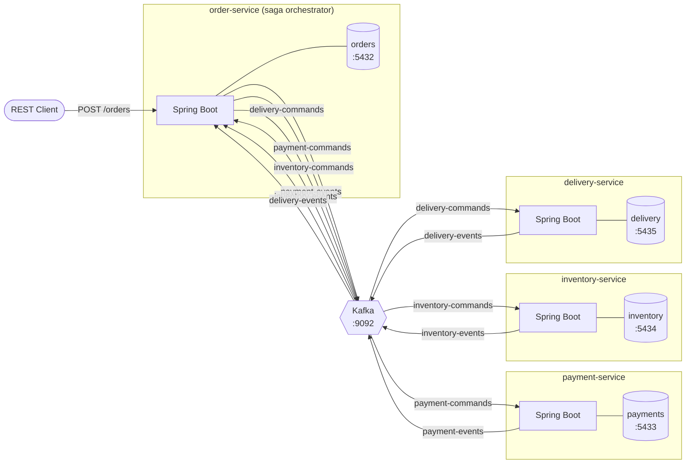
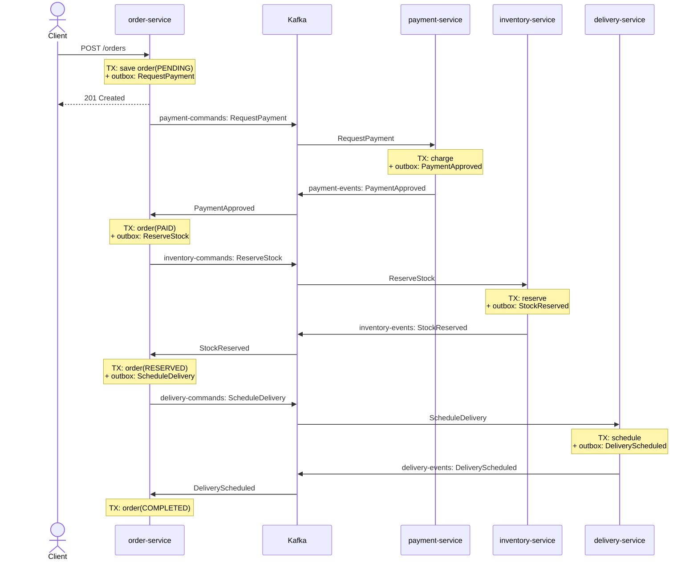
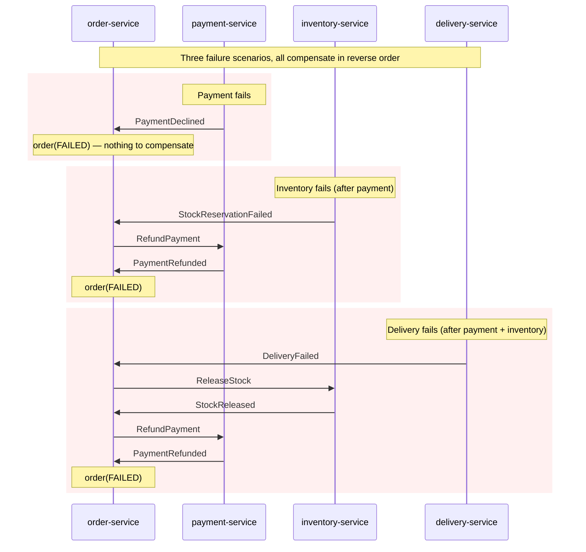
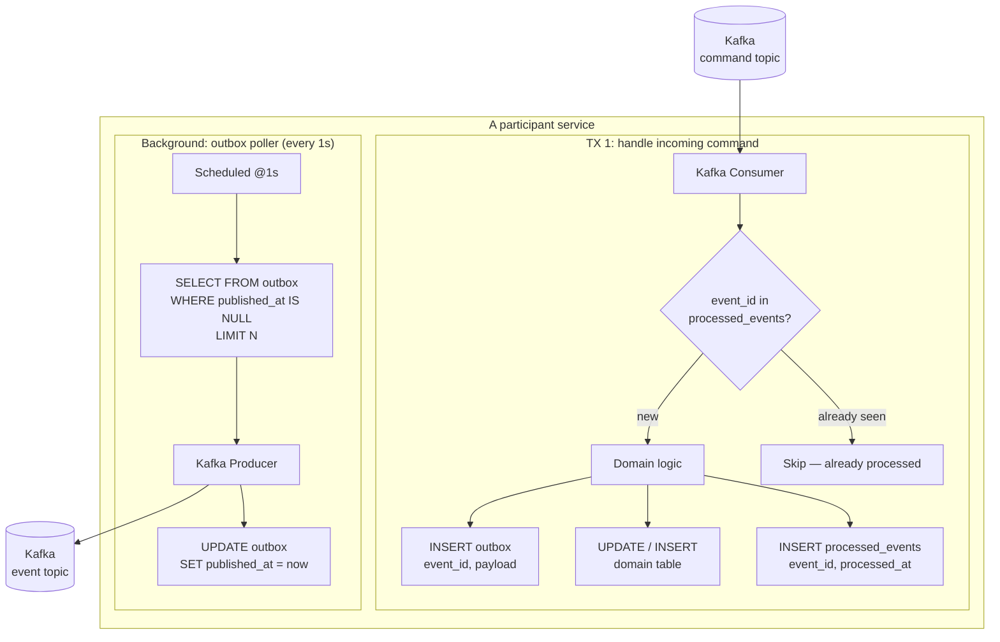

# Architecture

Living design doc for `outbox-saga-lab`. All four services and the subagents scaffolding them must follow the conventions in this file.

---

## 1. System architecture



**Topology**: Order Service is the only orchestrator. It sends commands and reacts to events. The three participants only know their own command/event topics.

---

## 2. Saga happy path



---

## 3. Compensation flow (failure at any step)



---

## 4. Outbox + idempotency (per-service internals)



**Both blocks are independent transactions:**
- **TX 1** writes the domain row + processed_events row + outbox row atomically. If any of these fails the whole thing rolls back — Kafka redelivers the command and we try again.
- **TX 2** is the poller: read unsent rows, publish to Kafka, mark sent. If publish succeeds but the mark fails, we'll re-publish — that's why every receiver checks `processed_events` first.

---

## 5. Conventions (all services must follow)

### Event envelope

Every Kafka message — command or event — uses this JSON shape:

```json
{
  "event_id":   "uuid-v4",
  "event_type": "PaymentApproved",
  "saga_id":    "uuid-v4",
  "occurred_at": "2026-05-05T12:34:56Z",
  "payload":    { ... event-specific ... }
}
```

- `event_id` — unique per emission, used for idempotency. Kafka redeliveries keep the same id.
- `saga_id` — equals the order id. Lets every service correlate logs and the orchestrator track state.
- `event_type` — string discriminator; consumers route on this.
- `payload` — the actual business data.

Use the **same JSON shape** in command topics and event topics — only `event_type` differs.

### Kafka topics

| Topic                | Producer    | Consumers     |
| -------------------- | ----------- | ------------- |
| `payment-commands`   | order       | payment       |
| `payment-events`     | payment     | order         |
| `inventory-commands` | order       | inventory     |
| `inventory-events`   | inventory   | order         |
| `delivery-commands` | order       | delivery      |
| `delivery-events`   | delivery    | order         |

Single partition per topic for the lab — keeps ordering simple. Auto-create enabled in dev compose.

### Standard tables (every service)

```sql
-- outbox: events not yet published to Kafka
CREATE TABLE outbox (
    id            BIGSERIAL PRIMARY KEY,
    event_id      UUID         NOT NULL UNIQUE,
    aggregate_id  VARCHAR(64)  NOT NULL,        -- usually saga_id / order id
    topic         VARCHAR(128) NOT NULL,
    event_type    VARCHAR(64)  NOT NULL,
    payload       JSONB        NOT NULL,
    created_at    TIMESTAMPTZ  NOT NULL DEFAULT now(),
    published_at  TIMESTAMPTZ
);
CREATE INDEX outbox_unpublished_idx ON outbox (created_at) WHERE published_at IS NULL;

-- processed_events: idempotency log for inbound messages
CREATE TABLE processed_events (
    event_id     UUID         PRIMARY KEY,
    event_type   VARCHAR(64)  NOT NULL,
    processed_at TIMESTAMPTZ  NOT NULL DEFAULT now()
);
```

Each service has its own database, but the schema for these two tables is identical across all four.

### Saga states (order-service only)

```
PENDING            → RequestPayment sent
PAYMENT_REQUESTED  → waiting for PaymentApproved/Declined
PAID               → ReserveStock sent
STOCK_REQUESTED    → waiting for StockReserved/Failed
RESERVED           → ScheduleDelivery sent
DELIVERY_REQUESTED → waiting for DeliveryScheduled/Failed
COMPLETED          → terminal success
FAILED             → terminal failure
COMPENSATING       → mid-rollback (sub-states optional)
```

### Service ports (host)

| Service     | App port | DB port |
| ----------- | -------- | ------- |
| order       | 8080     | 5432    |
| payment     | 8081     | 5433    |
| inventory   | 8082     | 5434    |
| delivery    | 8083     | 5435    |

Kafka exposed on `localhost:9092`.

### No shared library

Each service owns its own copy of event DTOs. This matches real-world microservices where services evolve schemas independently. Schema drift is acceptable — the JSON envelope is the contract.
