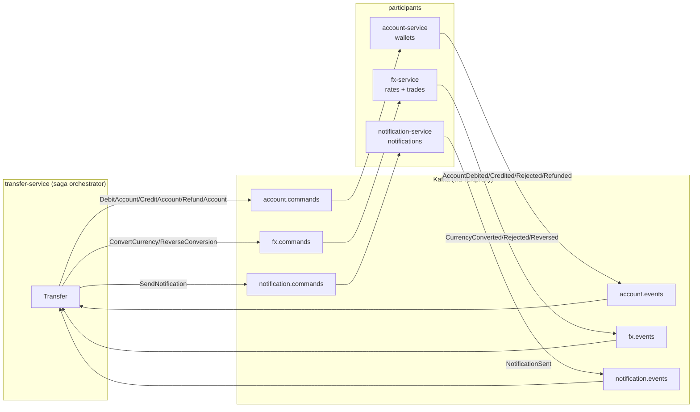
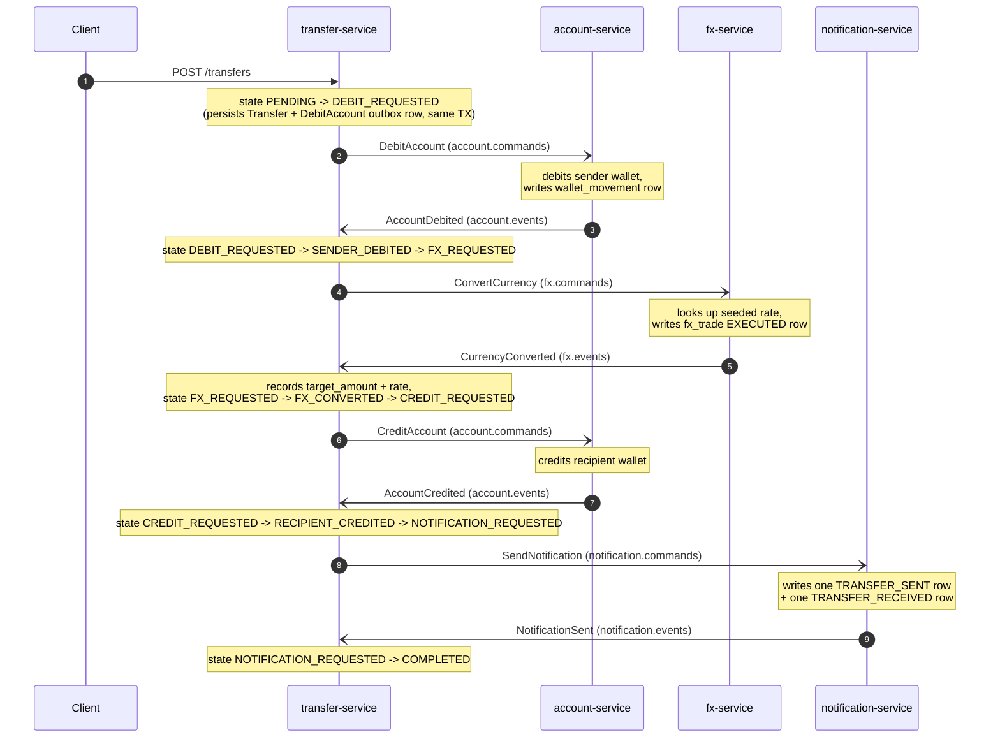
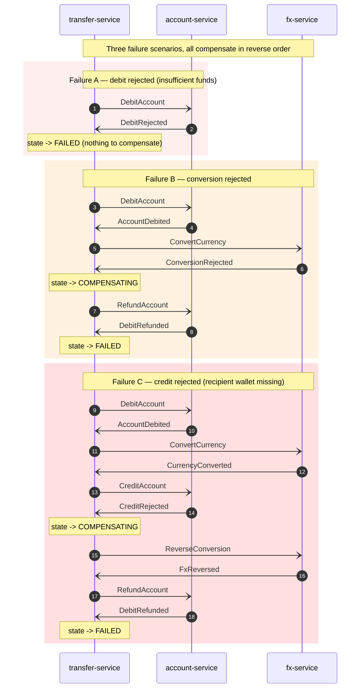

# Architecture

Living design doc for `outbox-saga-lab`. All four services and the subagents scaffolding them must follow the conventions in this file.

## 1. System overview



## 2. Saga happy path



## 3. Compensation flow



## 4. Idempotency check

```mermaid
flowchart TD
    A[Inbound message<br/>event_id, event_type] --> B{processed_events<br/>has event_id?}
    B -- yes --> C[Return early<br/>log "skipping duplicate"]
    B -- no --> D[Apply domain change]
    D --> E[Insert processed_events row]
    E --> F[Insert outbox row<br/>same TX]
    F --> G[Commit]
```

The check is the FIRST thing inside the transactional handler; the insert into `processed_events` happens in the same transaction as the domain work and the outbox row. Either everything commits or everything rolls back, and Kafka redelivery is harmless.

## 5. Event envelope

Every command and every event uses the same JSON envelope:

```json
{
  "event_id":    "uuid-v4",
  "event_type":  "AccountDebited",
  "saga_id":     "uuid-v4",
  "occurred_at": "2026-05-10T12:34:56Z",
  "payload":     { "...": "event-specific" }
}
```

`saga_id` equals the transfer id. Lets every service correlate logs and the orchestrator track state.

## 6. Topic catalogue

| Topic                    | Producer            | Consumer            | Purpose                           |
|--------------------------|---------------------|---------------------|-----------------------------------|
| `account.commands`       | transfer-service    | account-service     | Debit / Credit / Refund commands  |
| `account.events`         | account-service     | transfer-service    | Reply events from account         |
| `fx.commands`            | transfer-service    | fx-service          | Convert / Reverse commands        |
| `fx.events`              | fx-service          | transfer-service    | Reply events from fx              |
| `notification.commands`  | transfer-service    | notification-service| Send notification command         |
| `notification.events`    | notification-service| transfer-service    | Notification reply                |
| `transfer.events`        | transfer-service    | (observability)     | State transitions for inspection  |

Topic names use **dot** separators (`<service>.<commands|events>`).

## 7. Standard tables (every service)

Each service has its own database, but the schema for these two tables is identical across all four.

```sql
CREATE TABLE outbox (
    id            BIGSERIAL    PRIMARY KEY,
    event_id      UUID         NOT NULL UNIQUE,
    aggregate_id  VARCHAR(64)  NOT NULL,        -- usually saga_id / transfer id
    topic         VARCHAR(128) NOT NULL,
    event_type    VARCHAR(64)  NOT NULL,
    payload       JSONB        NOT NULL,
    created_at    TIMESTAMPTZ  NOT NULL DEFAULT now(),
    published_at  TIMESTAMPTZ
);

CREATE INDEX outbox_unpublished_idx ON outbox (created_at) WHERE published_at IS NULL;

CREATE TABLE processed_events (
    event_id     UUID         PRIMARY KEY,
    event_type   VARCHAR(64)  NOT NULL,
    processed_at TIMESTAMPTZ  NOT NULL DEFAULT now()
);
```

## 8. Saga states (transfer-service only)

```
PENDING                 → DebitAccount sent
DEBIT_REQUESTED         → waiting for AccountDebited / DebitRejected
SENDER_DEBITED          → ConvertCurrency sent
FX_REQUESTED            → waiting for CurrencyConverted / ConversionRejected
FX_CONVERTED            → CreditAccount sent
CREDIT_REQUESTED        → waiting for AccountCredited / CreditRejected
RECIPIENT_CREDITED      → SendNotification sent
NOTIFICATION_REQUESTED  → waiting for NotificationSent
COMPLETED               → terminal success
COMPENSATING            → mid-rollback (sub-states optional)
FAILED                  → terminal failure
```

## 9. Service ports

| Service                 | App port | DB port |
| ----------------------- | -------- | ------- |
| transfer-service        | 8080     | 5432    |
| account-service         | 8081     | 5433    |
| fx-service              | 8082     | 5434    |
| notification-service    | 8083     | 5435    |

Kafka exposed on `localhost:9092` (through Toxiproxy).

## 10. No shared library

Each service owns its own copy of event DTOs and the envelope record. This matches real-world microservices where services evolve schemas independently. Schema drift is acceptable — the JSON envelope is the contract.

## 11. Chaos topology

Toxiproxy sits between the host and Kafka. Default state: zero toxics — proxy is fully transparent, near-zero added latency. Chaos is opt-in via `./tools/chaos.sh`. The toxics that matter for studying redelivery and timeouts are: latency, jitter, slow_close, and bandwidth limits. Every saga path (happy + the three compensation paths) should be exercisable while toxics are active.
