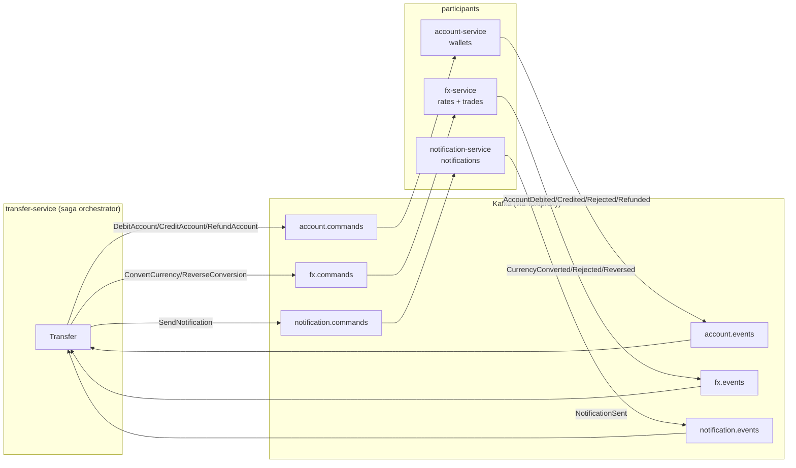
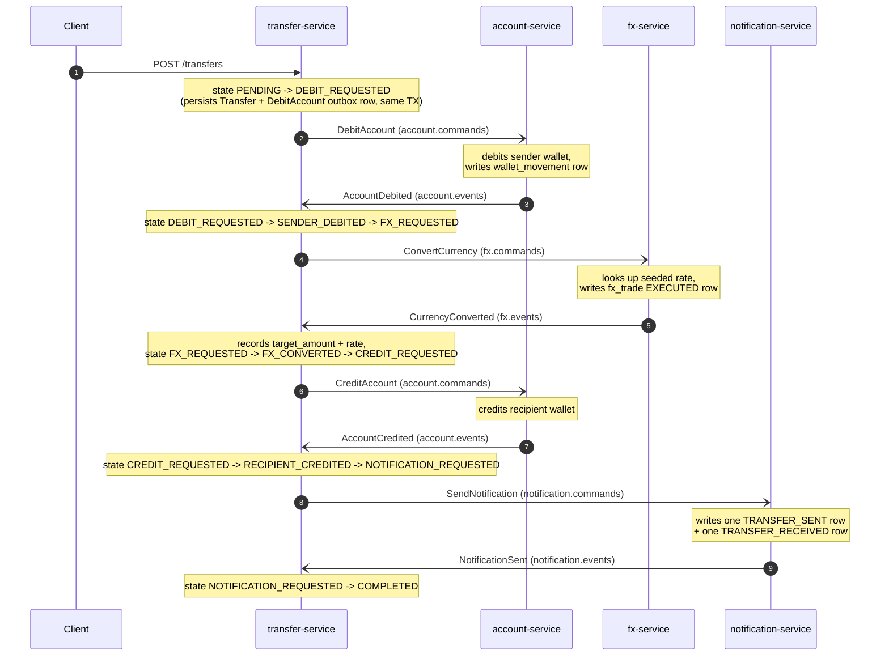
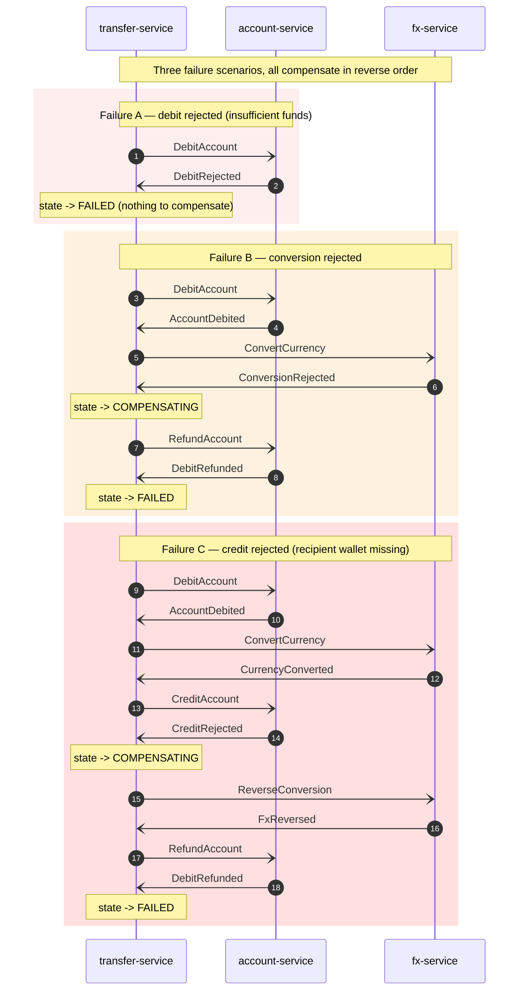

# Banking Backend Pivot Implementation Plan

> **For agentic workers:** REQUIRED SUB-SKILL: Use superpowers:subagent-driven-development (recommended) or superpowers:executing-plans to implement this plan task-by-task. Steps use checkbox (`- [ ]`) syntax for tracking.

**Goal:** Pivot the four-service learning project from e-commerce food ordering to a Revolut-style cross-currency P2P transfer backend, preserving the four distributed-systems patterns (microservices, outbox, saga, idempotent consumers) while replacing the entire domain layer.

**Architecture:** Rename in place on `main`. Reuse existing scaffolding (Kafka wiring, outbox poller, idempotency table, Flyway, Toxiproxy chaos, kafka-ui). Replace domain entities, REST controllers, saga states, Kafka topics, and Flyway migrations. Each service is renamed 1:1 with the spec mapping. Module shape (api / domain / idempotency / messaging / outbox / saga) is preserved.

**Tech Stack:** Java 21, Spring Boot 3.3.x, Spring Data JPA, Spring Kafka, PostgreSQL 16, Apache Kafka, Flyway, Gradle (Kotlin DSL, wrapper-driven), Docker Compose, Toxiproxy, k6.

**Spec:** `docs/superpowers/specs/2026-05-10-banking-backend-pivot-design.md`

---

## File Structure

The pivot touches these top-level locations:

| Existing path | New path | Reason |
|---|---|---|
| `order-service/` | `transfer-service/` | Saga orchestrator rename |
| `payment-service/` | `account-service/` | Wallet service rename |
| `inventory-service/` | `fx-service/` | FX engine rename |
| `delivery-service/` | `notification-service/` | Notification service rename |
| `docker-compose.yml` | (modified) | DB names + container names + volumes |
| `CLAUDE.md` | (modified) | Project charter |
| `docs/architecture.md` | (rewritten) | Mermaid diagrams + conventions |
| `docs/operations.md` | (rewritten) | docker exec recipes + traffic + chaos |
| `traffic-sim/scenarios.js` | (rewritten) | k6 scenarios for transfers |
| `tools/chaos.sh` | (modified) | Topic names in chaos commands |

Inside each renamed service:
- Java package root: `com.outboxsagalab.<old>` → `com.outboxsagalab.<new>`
- Domain classes replaced (Order/Payment/Reservation/Delivery → Transfer/Wallet/FxTrade/Notification)
- `Topics.java` constants and topic names updated
- Flyway `V1__init.sql` rewritten; new `V2__seed_*.sql` for account-service and fx-service
- `application.yml` datasource URL + db name updated
- `EventEnvelope.java` and `outbox` / `processed_events` tables: **unchanged in shape**

---

## Task ordering rationale

1. **Foundation first** (Task 1): docker-compose, charter — these cross every service.
2. **Orchestrator next** (Task 2): `transfer-service` defines the saga and the event-type contract every participant must implement.
3. **Participants** (Tasks 3–5): each rewritten using the same recipe, adapted to its domain.
4. **Tooling and docs** (Tasks 6–8): traffic sim, architecture doc, operations doc.
5. **End-to-end verification** (Task 9): build everything, bring the stack up, exercise happy path and one compensation path.

---

### Task 1: Foundation rename — charter + docker-compose

**Files:**
- Modify: `CLAUDE.md`
- Modify: `docker-compose.yml`
- Modify: `tools/chaos.sh`

- [ ] **Step 1: Update `CLAUDE.md` charter section**

Replace the top of the file (everything from `# outbox-saga-lab` through the end of the "Services" section table) with a banking charter. Keep the "Tech stack", "Project layout", "Working agreements", and "Out of scope" sections — they still apply, only update the directory names in "Project layout".

Open `CLAUDE.md` and replace lines 1–35 (charter + services table) with:

```markdown
# outbox-saga-lab

Personal learning project — a small Revolut-style banking backend built end-to-end to strengthen hands-on knowledge of distributed-systems patterns. The goal is **understanding**, not production-readiness — code stays readable and the patterns must be visible at a glance.

The four implemented patterns:

- **Microservices** with database-per-service.
- **Outbox pattern** for reliable event publishing.
- **Saga orchestration** with compensating transactions.
- **Idempotent consumers** for Kafka redelivery.

When introducing or modifying a pattern, prefer the textbook implementation over a clever shortcut. Comments and naming should make the pattern obvious — this is study code.

The core flow is a **cross-currency peer-to-peer money transfer**: debit the sender's wallet, FX-convert, credit the recipient's wallet, notify both parties. Every leg is reversible, exercising the compensation chain.

---
```

Then in the same file, find the "## Services" table and replace it with:

```markdown
## Services

| Service                | Responsibility                                  | Port |
| ---------------------- | ----------------------------------------------- | ---- |
| `transfer-service`     | Saga orchestrator — owns the transfer lifecycle | 8080 |
| `account-service`      | Wallets per (user, currency); debit/credit/refund | 8081 |
| `fx-service`           | Currency conversion using a seeded rate table   | 8082 |
| `notification-service` | Records sent notifications (no real push)       | 8083 |

`transfer-service` drives the saga. `account-service`, `fx-service`, and `notification-service` are participants and emit reply events. The full happy-path + compensation flows are in `docs/architecture.md` §2–§3.
```

Then in the "## Project layout" section, replace the directory tree block with:

```
outbox-saga-lab/
├── docker-compose.yml      # zookeeper, kafka, 4x postgres, toxiproxy, kafka-ui
├── docs/
│   ├── architecture.md     # diagrams + conventions (the contract)
│   └── operations.md       # running, traffic, chaos, debugging
├── transfer-service/       # saga orchestrator
├── account-service/        # saga participant — wallets
├── fx-service/             # saga participant — currency conversion
├── notification-service/   # saga participant — notifications
├── tools/
│   ├── chaos.sh            # toxiproxy shortcuts
│   └── toxiproxy/          # init config
└── traffic-sim/
    └── scenarios.js        # k6 traffic scenarios
```

Leave the rest of the file unchanged.

- [ ] **Step 2: Update `docker-compose.yml` to rename databases**

Replace the four `*-db` service blocks. Old names (`orders-db`, `payments-db`, `inventory-db`, `delivery-db`) become (`transfers-db`, `accounts-db`, `fx-db`, `notifications-db`). Update database/user/password and volume names accordingly.

In `docker-compose.yml`, replace lines 76–148 (the four db services + the volumes block) with:

```yaml
  transfers-db:
    image: postgres:16-alpine
    container_name: transfers-db
    ports:
      - "5432:5432"
    environment:
      POSTGRES_DB: transfers
      POSTGRES_USER: transfers
      POSTGRES_PASSWORD: transfers
    volumes:
      - transfers-data:/var/lib/postgresql/data
    healthcheck:
      test: ["CMD", "pg_isready", "-U", "transfers"]
      interval: 5s
      timeout: 3s
      retries: 10

  accounts-db:
    image: postgres:16-alpine
    container_name: accounts-db
    ports:
      - "5433:5432"
    environment:
      POSTGRES_DB: accounts
      POSTGRES_USER: accounts
      POSTGRES_PASSWORD: accounts
    volumes:
      - accounts-data:/var/lib/postgresql/data
    healthcheck:
      test: ["CMD", "pg_isready", "-U", "accounts"]
      interval: 5s
      timeout: 3s
      retries: 10

  fx-db:
    image: postgres:16-alpine
    container_name: fx-db
    ports:
      - "5434:5432"
    environment:
      POSTGRES_DB: fx
      POSTGRES_USER: fx
      POSTGRES_PASSWORD: fx
    volumes:
      - fx-data:/var/lib/postgresql/data
    healthcheck:
      test: ["CMD", "pg_isready", "-U", "fx"]
      interval: 5s
      timeout: 3s
      retries: 10

  notifications-db:
    image: postgres:16-alpine
    container_name: notifications-db
    ports:
      - "5435:5432"
    environment:
      POSTGRES_DB: notifications
      POSTGRES_USER: notifications
      POSTGRES_PASSWORD: notifications
    volumes:
      - notifications-data:/var/lib/postgresql/data
    healthcheck:
      test: ["CMD", "pg_isready", "-U", "notifications"]
      interval: 5s
      timeout: 3s
      retries: 10

volumes:
  transfers-data:
  accounts-data:
  fx-data:
  notifications-data:
```

- [ ] **Step 3: Verify docker-compose still parses**

Run: `docker compose -f docker-compose.yml config >/dev/null && echo OK`
Expected: prints `OK` with no errors.

- [ ] **Step 4: Drop any old Postgres volumes from prior experiments**

Because the project never ran end-to-end, but Docker may still hold stub volumes from earlier `docker compose up` attempts:

Run: `docker volume ls | grep -E '(orders|payments|inventory|delivery)-data' | awk '{print $2}' | xargs -r docker volume rm`
Expected: removes any leftover volumes; nothing removed is fine.

- [ ] **Step 5: Update `tools/chaos.sh` topic references**

Open `tools/chaos.sh`. Find any references to old topic names (`payment-commands`, `payment-events`, `inventory-commands`, `inventory-events`, `delivery-commands`, `delivery-events`, `order-commands`, `order-events`) and replace them with the new ones:

| Old | New |
|---|---|
| `order-commands` | `transfer.commands` |
| `order-events` | `transfer.events` |
| `payment-commands` | `account.commands` |
| `payment-events` | `account.events` |
| `inventory-commands` | `fx.commands` |
| `inventory-events` | `fx.events` |
| `delivery-commands` | `notification.commands` |
| `delivery-events` | `notification.events` |

Note the topic naming format also changes from `<svc>-commands` (hyphen) to `<svc>.commands` (dot) per the spec §6.

If the script has no topic-name references, leave it unchanged.

- [ ] **Step 6: Commit**

```bash
git add CLAUDE.md docker-compose.yml tools/chaos.sh
git commit -m "Rename infrastructure: charter + databases + chaos topics for banking pivot"
```

---

### Task 2: Pivot order-service → transfer-service (saga orchestrator)

**Files:**
- Move directory: `order-service/` → `transfer-service/`
- Modify all files inside (package rename + domain replacement)
- Replace domain/, api/, saga/ contents
- Rewrite `db/migration/V1__init.sql`
- Rewrite `application.yml` for new datasource

- [ ] **Step 1: Rename module directory and Gradle settings**

```bash
git mv order-service transfer-service
```

Then edit `transfer-service/settings.gradle.kts` and change the rootProject.name:

```kotlin
rootProject.name = "transfer-service"
```

Edit `transfer-service/build.gradle.kts`. Change any references to `com.outboxsagalab.order` (typically only in the `application { mainClass.set(...) }` block) to `com.outboxsagalab.transfer.TransferApplication`.

- [ ] **Step 2: Move Java package directory**

```bash
mkdir -p transfer-service/src/main/java/com/outboxsagalab/transfer
git mv transfer-service/src/main/java/com/outboxsagalab/order/* transfer-service/src/main/java/com/outboxsagalab/transfer/
rmdir transfer-service/src/main/java/com/outboxsagalab/order
```

- [ ] **Step 3: Rewrite `TransferApplication.java`**

Delete `transfer-service/src/main/java/com/outboxsagalab/transfer/OrderApplication.java`. Create `transfer-service/src/main/java/com/outboxsagalab/transfer/TransferApplication.java`:

```java
package com.outboxsagalab.transfer;

import org.springframework.boot.SpringApplication;
import org.springframework.boot.autoconfigure.SpringBootApplication;
import org.springframework.scheduling.annotation.EnableScheduling;

@SpringBootApplication
@EnableScheduling
public class TransferApplication {
    public static void main(String[] args) {
        SpringApplication.run(TransferApplication.class, args);
    }
}
```

```bash
rm transfer-service/src/main/java/com/outboxsagalab/transfer/OrderApplication.java
```

- [ ] **Step 4: Update package declarations and imports across the service**

Run a recursive in-place replacement for the package root:

```bash
find transfer-service/src -type f -name "*.java" -exec sed -i '' \
  -e 's/com\.outboxsagalab\.order/com.outboxsagalab.transfer/g' \
  {} +
```

Verify it succeeded: `grep -r "com.outboxsagalab.order" transfer-service/src` should print nothing.

- [ ] **Step 5: Rewrite `domain/Transfer.java` (replaces Order.java)**

Delete the old domain files:

```bash
rm transfer-service/src/main/java/com/outboxsagalab/transfer/domain/Order.java \
   transfer-service/src/main/java/com/outboxsagalab/transfer/domain/OrderItem.java \
   transfer-service/src/main/java/com/outboxsagalab/transfer/domain/OrderRepository.java \
   transfer-service/src/main/java/com/outboxsagalab/transfer/domain/OrderStatus.java
```

Create `transfer-service/src/main/java/com/outboxsagalab/transfer/domain/Transfer.java`:

```java
package com.outboxsagalab.transfer.domain;

import jakarta.persistence.Column;
import jakarta.persistence.Entity;
import jakarta.persistence.EnumType;
import jakarta.persistence.Enumerated;
import jakarta.persistence.Id;
import jakarta.persistence.Table;
import org.hibernate.annotations.UpdateTimestamp;

import java.math.BigDecimal;
import java.time.Instant;
import java.util.UUID;

/**
 * Saga aggregate root for a cross-currency P2P money transfer.
 *
 * One row per transfer. The {@code state} column is the saga state machine;
 * see {@code docs/architecture.md} §2.
 */
@Entity
@Table(name = "transfer")
public class Transfer {

    @Id
    private UUID id;

    @Column(name = "sender_user", nullable = false)
    private String senderUser;

    @Column(name = "sender_currency", nullable = false, length = 3)
    private String senderCurrency;

    @Column(name = "recipient_user", nullable = false)
    private String recipientUser;

    @Column(name = "recipient_currency", nullable = false, length = 3)
    private String recipientCurrency;

    @Column(name = "source_amount", nullable = false, precision = 19, scale = 4)
    private BigDecimal sourceAmount;

    @Column(name = "target_amount", precision = 19, scale = 4)
    private BigDecimal targetAmount;

    @Column(name = "rate", precision = 19, scale = 8)
    private BigDecimal rate;

    @Enumerated(EnumType.STRING)
    @Column(name = "state", nullable = false, length = 32)
    private TransferState state;

    @Column(name = "created_at", nullable = false, updatable = false)
    private Instant createdAt;

    @UpdateTimestamp
    @Column(name = "updated_at", nullable = false)
    private Instant updatedAt;

    protected Transfer() { /* JPA */ }

    public Transfer(UUID id,
                    String senderUser, String senderCurrency,
                    String recipientUser, String recipientCurrency,
                    BigDecimal sourceAmount) {
        this.id = id;
        this.senderUser = senderUser;
        this.senderCurrency = senderCurrency;
        this.recipientUser = recipientUser;
        this.recipientCurrency = recipientCurrency;
        this.sourceAmount = sourceAmount;
        this.state = TransferState.PENDING;
        this.createdAt = Instant.now();
    }

    public void transitionTo(TransferState next) {
        this.state = next;
    }

    public void recordFx(BigDecimal targetAmount, BigDecimal rate) {
        this.targetAmount = targetAmount;
        this.rate = rate;
    }

    public UUID getId() { return id; }
    public String getSenderUser() { return senderUser; }
    public String getSenderCurrency() { return senderCurrency; }
    public String getRecipientUser() { return recipientUser; }
    public String getRecipientCurrency() { return recipientCurrency; }
    public BigDecimal getSourceAmount() { return sourceAmount; }
    public BigDecimal getTargetAmount() { return targetAmount; }
    public BigDecimal getRate() { return rate; }
    public TransferState getState() { return state; }
    public Instant getCreatedAt() { return createdAt; }
    public Instant getUpdatedAt() { return updatedAt; }
}
```

- [ ] **Step 6: Create `domain/TransferState.java`**

Create `transfer-service/src/main/java/com/outboxsagalab/transfer/domain/TransferState.java`:

```java
package com.outboxsagalab.transfer.domain;

/**
 * Saga state machine for a transfer. Mirrors the *_REQUESTED → *_DONE
 * waiting-state convention used in {@code docs/architecture.md}.
 */
public enum TransferState {
    PENDING,
    DEBIT_REQUESTED,
    SENDER_DEBITED,
    FX_REQUESTED,
    FX_CONVERTED,
    CREDIT_REQUESTED,
    RECIPIENT_CREDITED,
    NOTIFICATION_REQUESTED,
    COMPLETED,
    COMPENSATING,
    FAILED
}
```

- [ ] **Step 7: Create `domain/TransferRepository.java`**

Create `transfer-service/src/main/java/com/outboxsagalab/transfer/domain/TransferRepository.java`:

```java
package com.outboxsagalab.transfer.domain;

import org.springframework.data.jpa.repository.JpaRepository;

import java.util.UUID;

public interface TransferRepository extends JpaRepository<Transfer, UUID> {
}
```

- [ ] **Step 8: Rewrite `messaging/Topics.java`**

Open `transfer-service/src/main/java/com/outboxsagalab/transfer/messaging/Topics.java` and replace its entire content with:

```java
package com.outboxsagalab.transfer.messaging;

/**
 * Kafka topic names visible to transfer-service. The orchestrator publishes
 * commands to participants and consumes reply events from each of them.
 *
 * <p>See {@code docs/architecture.md} §6.
 */
public final class Topics {

    // Commands the orchestrator publishes (one per participant):
    public static final String ACCOUNT_COMMANDS      = "account.commands";
    public static final String FX_COMMANDS           = "fx.commands";
    public static final String NOTIFICATION_COMMANDS = "notification.commands";

    // Events the orchestrator publishes for observability:
    public static final String TRANSFER_EVENTS       = "transfer.events";

    // Events the orchestrator consumes (replies from each participant):
    public static final String ACCOUNT_EVENTS        = "account.events";
    public static final String FX_EVENTS             = "fx.events";
    public static final String NOTIFICATION_EVENTS   = "notification.events";

    private Topics() { /* utility */ }
}
```

- [ ] **Step 9: Rewrite `saga/CommandTypes.java` and `saga/EventTypes.java`**

Replace `transfer-service/src/main/java/com/outboxsagalab/transfer/saga/CommandTypes.java` with:

```java
package com.outboxsagalab.transfer.saga;

/**
 * Constants for outbound command event_type values written to the outbox.
 * See spec §6.
 */
public final class CommandTypes {

    public static final String DEBIT_ACCOUNT       = "DebitAccount";
    public static final String CREDIT_ACCOUNT      = "CreditAccount";
    public static final String REFUND_ACCOUNT      = "RefundAccount";
    public static final String CONVERT_CURRENCY    = "ConvertCurrency";
    public static final String REVERSE_CONVERSION  = "ReverseConversion";
    public static final String SEND_NOTIFICATION   = "SendNotification";

    private CommandTypes() { /* utility */ }
}
```

Replace `transfer-service/src/main/java/com/outboxsagalab/transfer/saga/EventTypes.java` with:

```java
package com.outboxsagalab.transfer.saga;

/**
 * Constants for inbound reply event_type values consumed by the saga.
 * See spec §6.
 */
public final class EventTypes {

    public static final String ACCOUNT_DEBITED          = "AccountDebited";
    public static final String DEBIT_REJECTED           = "DebitRejected";
    public static final String DEBIT_REFUNDED           = "DebitRefunded";

    public static final String ACCOUNT_CREDITED         = "AccountCredited";
    public static final String CREDIT_REJECTED          = "CreditRejected";

    public static final String CURRENCY_CONVERTED       = "CurrencyConverted";
    public static final String CONVERSION_REJECTED      = "ConversionRejected";
    public static final String FX_REVERSED              = "FxReversed";

    public static final String NOTIFICATION_SENT        = "NotificationSent";

    private EventTypes() { /* utility */ }
}
```

- [ ] **Step 10: Rewrite `saga/CommandEmitter.java`**

Replace `transfer-service/src/main/java/com/outboxsagalab/transfer/saga/CommandEmitter.java` entirely with:

```java
package com.outboxsagalab.transfer.saga;

import com.fasterxml.jackson.databind.JsonNode;
import com.fasterxml.jackson.databind.ObjectMapper;
import com.fasterxml.jackson.databind.node.ObjectNode;
import com.outboxsagalab.transfer.domain.Transfer;
import com.outboxsagalab.transfer.messaging.Topics;
import com.outboxsagalab.transfer.outbox.OutboxEntry;
import com.outboxsagalab.transfer.outbox.OutboxRepository;
import org.slf4j.Logger;
import org.slf4j.LoggerFactory;
import org.springframework.stereotype.Component;

import java.util.UUID;

/**
 * Writes outbound commands as outbox rows. The saga calls this in its
 * transaction; the outbox poller drains rows to Kafka separately.
 */
@Component
public class CommandEmitter {

    private static final Logger log = LoggerFactory.getLogger(CommandEmitter.class);

    private final OutboxRepository outbox;
    private final ObjectMapper json;

    public CommandEmitter(OutboxRepository outbox, ObjectMapper json) {
        this.outbox = outbox;
        this.json = json;
    }

    public void debitAccount(Transfer t) {
        ObjectNode p = json.createObjectNode();
        p.put("transfer_id", t.getId().toString());
        p.put("user", t.getSenderUser());
        p.put("currency", t.getSenderCurrency());
        p.put("amount", t.getSourceAmount());
        emit(t.getId(), Topics.ACCOUNT_COMMANDS, CommandTypes.DEBIT_ACCOUNT, p);
    }

    public void refundAccount(Transfer t) {
        ObjectNode p = json.createObjectNode();
        p.put("transfer_id", t.getId().toString());
        p.put("user", t.getSenderUser());
        p.put("currency", t.getSenderCurrency());
        p.put("amount", t.getSourceAmount());
        emit(t.getId(), Topics.ACCOUNT_COMMANDS, CommandTypes.REFUND_ACCOUNT, p);
    }

    public void creditAccount(Transfer t) {
        ObjectNode p = json.createObjectNode();
        p.put("transfer_id", t.getId().toString());
        p.put("user", t.getRecipientUser());
        p.put("currency", t.getRecipientCurrency());
        p.put("amount", t.getTargetAmount());
        emit(t.getId(), Topics.ACCOUNT_COMMANDS, CommandTypes.CREDIT_ACCOUNT, p);
    }

    public void convertCurrency(Transfer t) {
        ObjectNode p = json.createObjectNode();
        p.put("transfer_id", t.getId().toString());
        p.put("base_currency", t.getSenderCurrency());
        p.put("quote_currency", t.getRecipientCurrency());
        p.put("base_amount", t.getSourceAmount());
        emit(t.getId(), Topics.FX_COMMANDS, CommandTypes.CONVERT_CURRENCY, p);
    }

    public void reverseConversion(Transfer t) {
        ObjectNode p = json.createObjectNode();
        p.put("transfer_id", t.getId().toString());
        emit(t.getId(), Topics.FX_COMMANDS, CommandTypes.REVERSE_CONVERSION, p);
    }

    public void sendNotification(Transfer t, String kind) {
        ObjectNode p = json.createObjectNode();
        p.put("transfer_id", t.getId().toString());
        p.put("kind", kind);
        p.put("sender_user", t.getSenderUser());
        p.put("recipient_user", t.getRecipientUser());
        p.put("sender_currency", t.getSenderCurrency());
        p.put("recipient_currency", t.getRecipientCurrency());
        p.put("source_amount", t.getSourceAmount());
        if (t.getTargetAmount() != null) {
            p.put("target_amount", t.getTargetAmount());
        }
        emit(t.getId(), Topics.NOTIFICATION_COMMANDS, CommandTypes.SEND_NOTIFICATION, p);
    }

    private void emit(UUID sagaId, String topic, String eventType, JsonNode payload) {
        UUID eventId = UUID.randomUUID();
        OutboxEntry entry = new OutboxEntry(eventId, sagaId.toString(), topic, eventType, payload);
        outbox.save(entry);
        log.info("Outbox <- enqueued topic={} event_type={} event_id={} saga_id={}",
                topic, eventType, eventId, sagaId);
    }
}
```

- [ ] **Step 11: Rewrite `saga/TransferSaga.java` (replaces OrderSaga.java)**

Delete `OrderSaga.java`:

```bash
rm transfer-service/src/main/java/com/outboxsagalab/transfer/saga/OrderSaga.java
```

Create `transfer-service/src/main/java/com/outboxsagalab/transfer/saga/TransferSaga.java`:

```java
package com.outboxsagalab.transfer.saga;

import com.fasterxml.jackson.databind.JsonNode;
import com.outboxsagalab.transfer.domain.Transfer;
import com.outboxsagalab.transfer.domain.TransferRepository;
import com.outboxsagalab.transfer.domain.TransferState;
import com.outboxsagalab.transfer.idempotency.ProcessedEvent;
import com.outboxsagalab.transfer.idempotency.ProcessedEventRepository;
import com.outboxsagalab.transfer.messaging.EventEnvelope;
import org.slf4j.Logger;
import org.slf4j.LoggerFactory;
import org.springframework.stereotype.Component;
import org.springframework.transaction.annotation.Transactional;

import java.math.BigDecimal;
import java.util.UUID;

/**
 * Saga state machine for a cross-currency P2P transfer.
 *
 * <p>Single transactional entry point: idempotency check first, then routing
 * on event_type, then mark the inbound event as processed. Domain change +
 * outbox row + processed_event insert all commit together.
 *
 * <p>Happy path:
 * <pre>
 *   PENDING                ─DebitAccount─►  DEBIT_REQUESTED
 *   DEBIT_REQUESTED        ◄─AccountDebited─ SENDER_DEBITED  ─ConvertCurrency─►  FX_REQUESTED
 *   FX_REQUESTED           ◄─CurrencyConverted─ FX_CONVERTED  ─CreditAccount─►   CREDIT_REQUESTED
 *   CREDIT_REQUESTED       ◄─AccountCredited─ RECIPIENT_CREDITED ─SendNotification─► NOTIFICATION_REQUESTED
 *   NOTIFICATION_REQUESTED ◄─NotificationSent─ COMPLETED
 * </pre>
 *
 * <p>Compensation chains: see spec §4.
 */
@Component
public class TransferSaga {

    private static final Logger log = LoggerFactory.getLogger(TransferSaga.class);

    private final TransferRepository transfers;
    private final ProcessedEventRepository processedEvents;
    private final CommandEmitter commands;

    public TransferSaga(TransferRepository transfers,
                        ProcessedEventRepository processedEvents,
                        CommandEmitter commands) {
        this.transfers = transfers;
        this.processedEvents = processedEvents;
        this.commands = commands;
    }

    @Transactional
    public void handle(EventEnvelope envelope) {
        UUID eventId = envelope.eventId();
        String type = envelope.eventType();
        UUID sagaId = envelope.sagaId();

        if (processedEvents.existsById(eventId)) {
            log.info("Skipping duplicate event event_id={} type={} saga_id={}", eventId, type, sagaId);
            return;
        }

        log.info("Saga consumed event_type={} event_id={} saga_id={}", type, eventId, sagaId);

        Transfer t = transfers.findById(sagaId)
                .orElseThrow(() -> new IllegalStateException(
                        "Unknown saga_id=" + sagaId + " for event_id=" + eventId));

        switch (type) {
            case EventTypes.ACCOUNT_DEBITED      -> onAccountDebited(t);
            case EventTypes.DEBIT_REJECTED       -> onDebitRejected(t);
            case EventTypes.CURRENCY_CONVERTED   -> onCurrencyConverted(t, envelope.payload());
            case EventTypes.CONVERSION_REJECTED  -> onConversionRejected(t);
            case EventTypes.ACCOUNT_CREDITED     -> onAccountCredited(t);
            case EventTypes.CREDIT_REJECTED      -> onCreditRejected(t);
            case EventTypes.FX_REVERSED          -> onFxReversed(t);
            case EventTypes.DEBIT_REFUNDED       -> onDebitRefunded(t);
            case EventTypes.NOTIFICATION_SENT    -> onNotificationSent(t);
            default -> log.warn("Saga ignoring unknown event_type={} event_id={} saga_id={}",
                    type, eventId, sagaId);
        }

        processedEvents.save(new ProcessedEvent(eventId, type));
    }

    // -------- happy-path handlers --------

    private void onAccountDebited(Transfer t) {
        require(t, TransferState.DEBIT_REQUESTED, EventTypes.ACCOUNT_DEBITED);
        transition(t, TransferState.SENDER_DEBITED);
        commands.convertCurrency(t);
        transition(t, TransferState.FX_REQUESTED);
    }

    private void onCurrencyConverted(Transfer t, JsonNode payload) {
        require(t, TransferState.FX_REQUESTED, EventTypes.CURRENCY_CONVERTED);
        BigDecimal quoteAmount = new BigDecimal(payload.get("quote_amount").asText());
        BigDecimal rate = new BigDecimal(payload.get("rate").asText());
        t.recordFx(quoteAmount, rate);
        transition(t, TransferState.FX_CONVERTED);
        commands.creditAccount(t);
        transition(t, TransferState.CREDIT_REQUESTED);
    }

    private void onAccountCredited(Transfer t) {
        require(t, TransferState.CREDIT_REQUESTED, EventTypes.ACCOUNT_CREDITED);
        transition(t, TransferState.RECIPIENT_CREDITED);
        commands.sendNotification(t, "TRANSFER_SENT");
        transition(t, TransferState.NOTIFICATION_REQUESTED);
    }

    private void onNotificationSent(Transfer t) {
        require(t, TransferState.NOTIFICATION_REQUESTED, EventTypes.NOTIFICATION_SENT);
        transition(t, TransferState.COMPLETED);
    }

    // -------- failure handlers --------

    private void onDebitRejected(Transfer t) {
        require(t, TransferState.DEBIT_REQUESTED, EventTypes.DEBIT_REJECTED);
        // Nothing happened — terminal failure.
        transition(t, TransferState.FAILED);
    }

    private void onConversionRejected(Transfer t) {
        require(t, TransferState.FX_REQUESTED, EventTypes.CONVERSION_REJECTED);
        // Sender already debited — refund to roll back.
        transition(t, TransferState.COMPENSATING);
        commands.refundAccount(t);
    }

    private void onCreditRejected(Transfer t) {
        require(t, TransferState.CREDIT_REQUESTED, EventTypes.CREDIT_REJECTED);
        // Reverse FX first, then refund the original debit (handled when FxReversed arrives).
        transition(t, TransferState.COMPENSATING);
        commands.reverseConversion(t);
    }

    private void onFxReversed(Transfer t) {
        // Mid-compensation only.
        require(t, TransferState.COMPENSATING, EventTypes.FX_REVERSED);
        commands.refundAccount(t);
    }

    private void onDebitRefunded(Transfer t) {
        // Terminal step of any compensation chain that reached the refund stage.
        require(t, TransferState.COMPENSATING, EventTypes.DEBIT_REFUNDED);
        transition(t, TransferState.FAILED);
    }

    // -------- helpers --------

    private void require(Transfer t, TransferState expected, String eventType) {
        if (t.getState() != expected) {
            throw new IllegalStateException(
                    "Transfer " + t.getId() + " in state " + t.getState()
                            + " cannot accept event " + eventType + " (expected " + expected + ")");
        }
    }

    private void transition(Transfer t, TransferState next) {
        TransferState prev = t.getState();
        t.transitionTo(next);
        log.info("Saga state {} -> {} saga_id={}", prev, next, t.getId());
    }
}
```

- [ ] **Step 12: Replace the three reply listeners with three new ones**

Delete the old listeners:

```bash
rm transfer-service/src/main/java/com/outboxsagalab/transfer/messaging/PaymentEventsListener.java \
   transfer-service/src/main/java/com/outboxsagalab/transfer/messaging/InventoryEventsListener.java \
   transfer-service/src/main/java/com/outboxsagalab/transfer/messaging/DeliveryEventsListener.java
```

Create `transfer-service/src/main/java/com/outboxsagalab/transfer/messaging/AccountEventsListener.java`:

```java
package com.outboxsagalab.transfer.messaging;

import com.fasterxml.jackson.databind.ObjectMapper;
import com.outboxsagalab.transfer.saga.TransferSaga;
import org.slf4j.Logger;
import org.slf4j.LoggerFactory;
import org.springframework.kafka.annotation.KafkaListener;
import org.springframework.stereotype.Component;

@Component
public class AccountEventsListener {

    private static final Logger log = LoggerFactory.getLogger(AccountEventsListener.class);

    private final ObjectMapper json;
    private final TransferSaga saga;

    public AccountEventsListener(ObjectMapper json, TransferSaga saga) {
        this.json = json;
        this.saga = saga;
    }

    @KafkaListener(topics = Topics.ACCOUNT_EVENTS, groupId = "${spring.kafka.consumer.group-id}")
    public void onMessage(String raw) {
        EventEnvelope envelope;
        try {
            envelope = json.readValue(raw, EventEnvelope.class);
        } catch (Exception e) {
            log.error("Bad envelope on {}: {}", Topics.ACCOUNT_EVENTS, raw, e);
            return;
        }
        saga.handle(envelope);
    }
}
```

Create `transfer-service/src/main/java/com/outboxsagalab/transfer/messaging/FxEventsListener.java` (same shape, topic `Topics.FX_EVENTS`):

```java
package com.outboxsagalab.transfer.messaging;

import com.fasterxml.jackson.databind.ObjectMapper;
import com.outboxsagalab.transfer.saga.TransferSaga;
import org.slf4j.Logger;
import org.slf4j.LoggerFactory;
import org.springframework.kafka.annotation.KafkaListener;
import org.springframework.stereotype.Component;

@Component
public class FxEventsListener {

    private static final Logger log = LoggerFactory.getLogger(FxEventsListener.class);

    private final ObjectMapper json;
    private final TransferSaga saga;

    public FxEventsListener(ObjectMapper json, TransferSaga saga) {
        this.json = json;
        this.saga = saga;
    }

    @KafkaListener(topics = Topics.FX_EVENTS, groupId = "${spring.kafka.consumer.group-id}")
    public void onMessage(String raw) {
        EventEnvelope envelope;
        try {
            envelope = json.readValue(raw, EventEnvelope.class);
        } catch (Exception e) {
            log.error("Bad envelope on {}: {}", Topics.FX_EVENTS, raw, e);
            return;
        }
        saga.handle(envelope);
    }
}
```

Create `transfer-service/src/main/java/com/outboxsagalab/transfer/messaging/NotificationEventsListener.java` (same shape, topic `Topics.NOTIFICATION_EVENTS`):

```java
package com.outboxsagalab.transfer.messaging;

import com.fasterxml.jackson.databind.ObjectMapper;
import com.outboxsagalab.transfer.saga.TransferSaga;
import org.slf4j.Logger;
import org.slf4j.LoggerFactory;
import org.springframework.kafka.annotation.KafkaListener;
import org.springframework.stereotype.Component;

@Component
public class NotificationEventsListener {

    private static final Logger log = LoggerFactory.getLogger(NotificationEventsListener.class);

    private final ObjectMapper json;
    private final TransferSaga saga;

    public NotificationEventsListener(ObjectMapper json, TransferSaga saga) {
        this.json = json;
        this.saga = saga;
    }

    @KafkaListener(topics = Topics.NOTIFICATION_EVENTS, groupId = "${spring.kafka.consumer.group-id}")
    public void onMessage(String raw) {
        EventEnvelope envelope;
        try {
            envelope = json.readValue(raw, EventEnvelope.class);
        } catch (Exception e) {
            log.error("Bad envelope on {}: {}", Topics.NOTIFICATION_EVENTS, raw, e);
            return;
        }
        saga.handle(envelope);
    }
}
```

- [ ] **Step 13: Replace the REST controller and DTOs**

Delete the old API files:

```bash
rm transfer-service/src/main/java/com/outboxsagalab/transfer/api/OrderController.java \
   transfer-service/src/main/java/com/outboxsagalab/transfer/api/CreateOrderRequest.java \
   transfer-service/src/main/java/com/outboxsagalab/transfer/api/OrderResponse.java
```

Create `transfer-service/src/main/java/com/outboxsagalab/transfer/api/CreateTransferRequest.java`:

```java
package com.outboxsagalab.transfer.api;

import java.math.BigDecimal;

public record CreateTransferRequest(
        String senderUser,
        String senderCurrency,
        String recipientUser,
        String recipientCurrency,
        BigDecimal sourceAmount
) { }
```

Create `transfer-service/src/main/java/com/outboxsagalab/transfer/api/TransferResponse.java`:

```java
package com.outboxsagalab.transfer.api;

import com.outboxsagalab.transfer.domain.Transfer;

import java.math.BigDecimal;
import java.time.Instant;
import java.util.UUID;

public record TransferResponse(
        UUID id,
        String senderUser,
        String senderCurrency,
        String recipientUser,
        String recipientCurrency,
        BigDecimal sourceAmount,
        BigDecimal targetAmount,
        BigDecimal rate,
        String state,
        Instant createdAt,
        Instant updatedAt
) {
    public static TransferResponse from(Transfer t) {
        return new TransferResponse(
                t.getId(),
                t.getSenderUser(), t.getSenderCurrency(),
                t.getRecipientUser(), t.getRecipientCurrency(),
                t.getSourceAmount(), t.getTargetAmount(), t.getRate(),
                t.getState().name(),
                t.getCreatedAt(), t.getUpdatedAt());
    }
}
```

Create `transfer-service/src/main/java/com/outboxsagalab/transfer/api/TransferController.java`:

```java
package com.outboxsagalab.transfer.api;

import com.outboxsagalab.transfer.domain.Transfer;
import com.outboxsagalab.transfer.domain.TransferRepository;
import com.outboxsagalab.transfer.domain.TransferState;
import com.outboxsagalab.transfer.saga.CommandEmitter;
import org.slf4j.Logger;
import org.slf4j.LoggerFactory;
import org.springframework.http.ResponseEntity;
import org.springframework.transaction.annotation.Transactional;
import org.springframework.web.bind.annotation.GetMapping;
import org.springframework.web.bind.annotation.PathVariable;
import org.springframework.web.bind.annotation.PostMapping;
import org.springframework.web.bind.annotation.RequestBody;
import org.springframework.web.bind.annotation.RequestMapping;
import org.springframework.web.bind.annotation.RestController;

import java.net.URI;
import java.util.UUID;

/**
 * Public REST surface for transfer-service.
 *
 *   POST /transfers       -- create a transfer, kick off the saga (returns 201)
 *   GET  /transfers/{id}  -- current state for inspection
 *
 * The POST is the one domain write that doesn't go through the saga itself —
 * it persists the transfer + writes the first DebitAccount outbox row in a
 * single transaction, mirroring how the original order-service kicked off.
 */
@RestController
@RequestMapping("/transfers")
public class TransferController {

    private static final Logger log = LoggerFactory.getLogger(TransferController.class);

    private final TransferRepository transfers;
    private final CommandEmitter commands;

    public TransferController(TransferRepository transfers, CommandEmitter commands) {
        this.transfers = transfers;
        this.commands = commands;
    }

    @PostMapping
    @Transactional
    public ResponseEntity<TransferResponse> create(@RequestBody CreateTransferRequest req) {
        UUID id = UUID.randomUUID();
        Transfer t = new Transfer(
                id,
                req.senderUser(), req.senderCurrency(),
                req.recipientUser(), req.recipientCurrency(),
                req.sourceAmount());
        transfers.save(t);
        log.info("Transfer created saga_id={} {}->{} {}->{} amount={}",
                id, req.senderUser(), req.recipientUser(),
                req.senderCurrency(), req.recipientCurrency(), req.sourceAmount());

        commands.debitAccount(t);
        t.transitionTo(TransferState.DEBIT_REQUESTED);
        log.info("Saga state {} -> {} saga_id={}",
                TransferState.PENDING, TransferState.DEBIT_REQUESTED, id);

        return ResponseEntity
                .created(URI.create("/transfers/" + id))
                .body(TransferResponse.from(t));
    }

    @GetMapping("/{id}")
    public ResponseEntity<TransferResponse> get(@PathVariable("id") UUID id) {
        return transfers.findById(id)
                .map(TransferResponse::from)
                .map(ResponseEntity::ok)
                .orElseGet(() -> ResponseEntity.notFound().build());
    }
}
```

- [ ] **Step 14: Rewrite Flyway `V1__init.sql`**

Replace `transfer-service/src/main/resources/db/migration/V1__init.sql` entirely with:

```sql
-- transfer-service initial schema
-- Saga aggregate + cross-cutting outbox/processed_events. Schemas of the
-- last two are identical across all four services.

CREATE TABLE transfer (
    id                  UUID            PRIMARY KEY,
    sender_user         VARCHAR(64)     NOT NULL,
    sender_currency     CHAR(3)         NOT NULL,
    recipient_user      VARCHAR(64)     NOT NULL,
    recipient_currency  CHAR(3)         NOT NULL,
    source_amount       NUMERIC(19, 4)  NOT NULL,
    target_amount       NUMERIC(19, 4),
    rate                NUMERIC(19, 8),
    state               VARCHAR(32)     NOT NULL,
    created_at          TIMESTAMPTZ     NOT NULL DEFAULT now(),
    updated_at          TIMESTAMPTZ     NOT NULL DEFAULT now()
);

CREATE INDEX transfer_state_idx ON transfer (state);

CREATE TABLE outbox (
    id            BIGSERIAL    PRIMARY KEY,
    event_id      UUID         NOT NULL UNIQUE,
    aggregate_id  VARCHAR(64)  NOT NULL,
    topic         VARCHAR(128) NOT NULL,
    event_type    VARCHAR(64)  NOT NULL,
    payload       JSONB        NOT NULL,
    created_at    TIMESTAMPTZ  NOT NULL DEFAULT now(),
    published_at  TIMESTAMPTZ
);

CREATE INDEX outbox_unpublished_idx ON outbox (created_at) WHERE published_at IS NULL;

CREATE TABLE processed_events (
    event_id     UUID         PRIMARY KEY,
    event_type   VARCHAR(64)  NOT NULL,
    processed_at TIMESTAMPTZ  NOT NULL DEFAULT now()
);
```

- [ ] **Step 15: Update `application.yml`**

Replace `transfer-service/src/main/resources/application.yml` with:

```yaml
server:
  port: 8080

spring:
  application:
    name: transfer-service

  datasource:
    url: jdbc:postgresql://localhost:5432/transfers
    username: transfers
    password: transfers
    driver-class-name: org.postgresql.Driver

  jpa:
    hibernate:
      ddl-auto: validate
    properties:
      hibernate:
        jdbc:
          time_zone: UTC
        format_sql: false

  flyway:
    enabled: true
    locations: classpath:db/migration

  kafka:
    bootstrap-servers: localhost:9092
    consumer:
      group-id: transfer-service
      auto-offset-reset: earliest
      enable-auto-commit: false
      key-deserializer: org.apache.kafka.common.serialization.StringDeserializer
      value-deserializer: org.apache.kafka.common.serialization.StringDeserializer
    producer:
      key-serializer: org.apache.kafka.common.serialization.StringSerializer
      value-serializer: org.apache.kafka.common.serialization.StringSerializer
      acks: all
    listener:
      ack-mode: record

logging:
  level:
    com.outboxsagalab.transfer: INFO
    org.springframework.kafka: WARN
```

- [ ] **Step 16: Build the service**

```bash
cd transfer-service && ./gradlew clean build -x test
```

Expected: `BUILD SUCCESSFUL`. If a compilation error appears, fix it before continuing.

- [ ] **Step 17: Commit**

```bash
cd ..
git add transfer-service
git commit -m "Rewrite transfer-service: saga orchestrator for cross-currency P2P transfers"
```

---

### Task 3: Pivot payment-service → account-service (wallets)

**Files:**
- Move directory: `payment-service/` → `account-service/`
- Replace domain (Wallet + WalletMovement)
- Rewrite `PaymentService` → `AccountService` with debit/credit/refund
- Rewrite `Topics`, `V1__init.sql` + new `V2__seed_wallets.sql`
- Rewrite `application.yml`

- [ ] **Step 1: Rename module directory**

```bash
git mv payment-service account-service
```

Edit `account-service/settings.gradle.kts` and set `rootProject.name = "account-service"`.
Edit `account-service/build.gradle.kts` mainClass reference to `com.outboxsagalab.account.AccountApplication`.

- [ ] **Step 2: Move Java package directory**

```bash
mkdir -p account-service/src/main/java/com/outboxsagalab/account
git mv account-service/src/main/java/com/outboxsagalab/payment/* account-service/src/main/java/com/outboxsagalab/account/
rmdir account-service/src/main/java/com/outboxsagalab/payment
```

- [ ] **Step 3: Rewrite Application class**

```bash
rm account-service/src/main/java/com/outboxsagalab/account/PaymentApplication.java
```

Create `account-service/src/main/java/com/outboxsagalab/account/AccountApplication.java`:

```java
package com.outboxsagalab.account;

import org.springframework.boot.SpringApplication;
import org.springframework.boot.autoconfigure.SpringBootApplication;
import org.springframework.scheduling.annotation.EnableScheduling;

@SpringBootApplication
@EnableScheduling
public class AccountApplication {
    public static void main(String[] args) {
        SpringApplication.run(AccountApplication.class, args);
    }
}
```

- [ ] **Step 4: Update package roots across the service**

```bash
find account-service/src -type f -name "*.java" -exec sed -i '' \
  -e 's/com\.outboxsagalab\.payment/com.outboxsagalab.account/g' \
  {} +
```

Verify: `grep -r "com.outboxsagalab.payment" account-service/src` should print nothing.

- [ ] **Step 5: Replace domain classes**

Delete the old Payment domain:

```bash
rm account-service/src/main/java/com/outboxsagalab/account/domain/Payment.java \
   account-service/src/main/java/com/outboxsagalab/account/domain/PaymentRepository.java \
   account-service/src/main/java/com/outboxsagalab/account/domain/PaymentStatus.java \
   account-service/src/main/java/com/outboxsagalab/account/domain/PaymentService.java
```

Create `account-service/src/main/java/com/outboxsagalab/account/domain/Wallet.java`:

```java
package com.outboxsagalab.account.domain;

import jakarta.persistence.Column;
import jakarta.persistence.Entity;
import jakarta.persistence.Id;
import jakarta.persistence.Table;
import jakarta.persistence.UniqueConstraint;
import jakarta.persistence.Version;

import java.math.BigDecimal;
import java.util.UUID;

/**
 * Wallet aggregate. One row per (user_id, currency). Optimistic locking
 * via {@code @Version} guards against concurrent debit/credit collisions.
 */
@Entity
@Table(name = "wallet", uniqueConstraints = @UniqueConstraint(columnNames = {"user_id", "currency"}))
public class Wallet {

    @Id
    private UUID id;

    @Column(name = "user_id", nullable = false, length = 64)
    private String userId;

    @Column(name = "currency", nullable = false, length = 3)
    private String currency;

    @Column(name = "balance", nullable = false, precision = 19, scale = 4)
    private BigDecimal balance;

    @Version
    @Column(name = "version", nullable = false)
    private long version;

    protected Wallet() { /* JPA */ }

    public Wallet(UUID id, String userId, String currency, BigDecimal balance) {
        this.id = id;
        this.userId = userId;
        this.currency = currency;
        this.balance = balance;
    }

    public boolean canDebit(BigDecimal amount) {
        return balance.compareTo(amount) >= 0;
    }

    public void debit(BigDecimal amount) {
        if (!canDebit(amount)) {
            throw new IllegalStateException("Insufficient funds in wallet " + id);
        }
        this.balance = this.balance.subtract(amount);
    }

    public void credit(BigDecimal amount) {
        this.balance = this.balance.add(amount);
    }

    public UUID getId() { return id; }
    public String getUserId() { return userId; }
    public String getCurrency() { return currency; }
    public BigDecimal getBalance() { return balance; }
    public long getVersion() { return version; }
}
```

Create `account-service/src/main/java/com/outboxsagalab/account/domain/WalletRepository.java`:

```java
package com.outboxsagalab.account.domain;

import org.springframework.data.jpa.repository.JpaRepository;

import java.util.Optional;
import java.util.UUID;

public interface WalletRepository extends JpaRepository<Wallet, UUID> {
    Optional<Wallet> findByUserIdAndCurrency(String userId, String currency);
}
```

Create `account-service/src/main/java/com/outboxsagalab/account/domain/WalletMovementType.java`:

```java
package com.outboxsagalab.account.domain;

public enum WalletMovementType {
    DEBIT, CREDIT, REFUND
}
```

Create `account-service/src/main/java/com/outboxsagalab/account/domain/WalletMovement.java`:

```java
package com.outboxsagalab.account.domain;

import jakarta.persistence.Column;
import jakarta.persistence.Entity;
import jakarta.persistence.EnumType;
import jakarta.persistence.Enumerated;
import jakarta.persistence.Id;
import jakarta.persistence.Table;

import java.math.BigDecimal;
import java.time.Instant;
import java.util.UUID;

/**
 * Append-only journal of wallet changes. One row per applied debit/credit/refund.
 */
@Entity
@Table(name = "wallet_movement")
public class WalletMovement {

    @Id
    private UUID id;

    @Column(name = "wallet_id", nullable = false)
    private UUID walletId;

    @Column(name = "amount", nullable = false, precision = 19, scale = 4)
    private BigDecimal amount;     // always positive; direction is `type`

    @Enumerated(EnumType.STRING)
    @Column(name = "type", nullable = false, length = 16)
    private WalletMovementType type;

    @Column(name = "correlation_id", nullable = false)
    private UUID correlationId;     // = transfer id

    @Column(name = "created_at", nullable = false, updatable = false)
    private Instant createdAt;

    protected WalletMovement() { /* JPA */ }

    public WalletMovement(UUID id, UUID walletId, BigDecimal amount,
                          WalletMovementType type, UUID correlationId) {
        this.id = id;
        this.walletId = walletId;
        this.amount = amount;
        this.type = type;
        this.correlationId = correlationId;
        this.createdAt = Instant.now();
    }

    public UUID getId() { return id; }
    public UUID getWalletId() { return walletId; }
    public BigDecimal getAmount() { return amount; }
    public WalletMovementType getType() { return type; }
    public UUID getCorrelationId() { return correlationId; }
    public Instant getCreatedAt() { return createdAt; }
}
```

Create `account-service/src/main/java/com/outboxsagalab/account/domain/WalletMovementRepository.java`:

```java
package com.outboxsagalab.account.domain;

import org.springframework.data.jpa.repository.JpaRepository;

import java.util.UUID;

public interface WalletMovementRepository extends JpaRepository<WalletMovement, UUID> {
}
```

- [ ] **Step 6: Rewrite Topics**

Replace `account-service/src/main/java/com/outboxsagalab/account/messaging/Topics.java` with:

```java
package com.outboxsagalab.account.messaging;

public final class Topics {
    public static final String ACCOUNT_COMMANDS = "account.commands";
    public static final String ACCOUNT_EVENTS   = "account.events";

    private Topics() { /* utility */ }
}
```

- [ ] **Step 7: Replace `PaymentService` with `AccountService`**

Create `account-service/src/main/java/com/outboxsagalab/account/domain/AccountService.java`:

```java
package com.outboxsagalab.account.domain;

import com.fasterxml.jackson.core.JsonProcessingException;
import com.fasterxml.jackson.databind.ObjectMapper;
import com.fasterxml.jackson.databind.node.ObjectNode;
import com.outboxsagalab.account.idempotency.ProcessedEvent;
import com.outboxsagalab.account.idempotency.ProcessedEventRepository;
import com.outboxsagalab.account.messaging.Topics;
import com.outboxsagalab.account.outbox.OutboxEntry;
import com.outboxsagalab.account.outbox.OutboxRepository;
import org.slf4j.Logger;
import org.slf4j.LoggerFactory;
import org.springframework.stereotype.Service;
import org.springframework.transaction.annotation.Transactional;

import java.math.BigDecimal;
import java.time.Instant;
import java.util.UUID;

/**
 * Domain service for {@code DebitAccount}, {@code CreditAccount}, and
 * {@code RefundAccount} commands.
 *
 * <p>Each public method is one {@code @Transactional} unit following the
 * idempotent-saga-participant recipe:
 *
 * <ol>
 *   <li>Idempotency check on the inbound event_id.</li>
 *   <li>Domain work (wallet balance update + movement row).</li>
 *   <li>Mark the event processed.</li>
 *   <li>Enqueue the reply event in the outbox.</li>
 * </ol>
 *
 * <p>If the wallet doesn't exist or the debit would overdraw, we emit a
 * rejected event and the saga compensates / fails accordingly.
 */
@Service
public class AccountService {

    private static final Logger log = LoggerFactory.getLogger(AccountService.class);

    private final WalletRepository wallets;
    private final WalletMovementRepository movements;
    private final OutboxRepository outbox;
    private final ProcessedEventRepository processedEvents;
    private final ObjectMapper json;

    public AccountService(WalletRepository wallets,
                          WalletMovementRepository movements,
                          OutboxRepository outbox,
                          ProcessedEventRepository processedEvents,
                          ObjectMapper json) {
        this.wallets = wallets;
        this.movements = movements;
        this.outbox = outbox;
        this.processedEvents = processedEvents;
        this.json = json;
    }

    @Transactional
    public void debit(UUID inboundEventId, UUID transferId,
                      String userId, String currency, BigDecimal amount) {
        if (alreadyProcessed(inboundEventId, "DebitAccount", transferId)) return;

        var maybeWallet = wallets.findByUserIdAndCurrency(userId, currency);
        if (maybeWallet.isEmpty() || !maybeWallet.get().canDebit(amount)) {
            log.info("Debit rejected transfer_id={} user={} {} amount={}",
                    transferId, userId, currency, amount);
            processedEvents.save(new ProcessedEvent(inboundEventId, "DebitAccount"));
            ObjectNode reject = json.createObjectNode();
            reject.put("transfer_id", transferId.toString());
            reject.put("reason", maybeWallet.isEmpty() ? "WALLET_MISSING" : "INSUFFICIENT_FUNDS");
            enqueue(transferId, "DebitRejected", reject);
            return;
        }

        Wallet w = maybeWallet.get();
        w.debit(amount);
        wallets.save(w);
        movements.save(new WalletMovement(UUID.randomUUID(), w.getId(), amount,
                WalletMovementType.DEBIT, transferId));
        processedEvents.save(new ProcessedEvent(inboundEventId, "DebitAccount"));

        ObjectNode ok = json.createObjectNode();
        ok.put("transfer_id", transferId.toString());
        ok.put("user", userId);
        ok.put("currency", currency);
        ok.put("amount", amount);
        ok.put("new_balance", w.getBalance());
        enqueue(transferId, "AccountDebited", ok);

        log.info("Debited transfer_id={} user={} {} amount={} new_balance={}",
                transferId, userId, currency, amount, w.getBalance());
    }

    @Transactional
    public void credit(UUID inboundEventId, UUID transferId,
                       String userId, String currency, BigDecimal amount) {
        if (alreadyProcessed(inboundEventId, "CreditAccount", transferId)) return;

        var maybeWallet = wallets.findByUserIdAndCurrency(userId, currency);
        if (maybeWallet.isEmpty()) {
            log.info("Credit rejected (wallet missing) transfer_id={} user={} {}",
                    transferId, userId, currency);
            processedEvents.save(new ProcessedEvent(inboundEventId, "CreditAccount"));
            ObjectNode reject = json.createObjectNode();
            reject.put("transfer_id", transferId.toString());
            reject.put("reason", "WALLET_MISSING");
            enqueue(transferId, "CreditRejected", reject);
            return;
        }

        Wallet w = maybeWallet.get();
        w.credit(amount);
        wallets.save(w);
        movements.save(new WalletMovement(UUID.randomUUID(), w.getId(), amount,
                WalletMovementType.CREDIT, transferId));
        processedEvents.save(new ProcessedEvent(inboundEventId, "CreditAccount"));

        ObjectNode ok = json.createObjectNode();
        ok.put("transfer_id", transferId.toString());
        ok.put("user", userId);
        ok.put("currency", currency);
        ok.put("amount", amount);
        ok.put("new_balance", w.getBalance());
        enqueue(transferId, "AccountCredited", ok);

        log.info("Credited transfer_id={} user={} {} amount={} new_balance={}",
                transferId, userId, currency, amount, w.getBalance());
    }

    @Transactional
    public void refund(UUID inboundEventId, UUID transferId,
                       String userId, String currency, BigDecimal amount) {
        if (alreadyProcessed(inboundEventId, "RefundAccount", transferId)) return;

        Wallet w = wallets.findByUserIdAndCurrency(userId, currency)
                .orElseThrow(() -> new IllegalStateException(
                        "Refund target wallet missing user=" + userId + " " + currency));
        w.credit(amount);
        wallets.save(w);
        movements.save(new WalletMovement(UUID.randomUUID(), w.getId(), amount,
                WalletMovementType.REFUND, transferId));
        processedEvents.save(new ProcessedEvent(inboundEventId, "RefundAccount"));

        ObjectNode ok = json.createObjectNode();
        ok.put("transfer_id", transferId.toString());
        ok.put("user", userId);
        ok.put("currency", currency);
        ok.put("amount", amount);
        ok.put("new_balance", w.getBalance());
        enqueue(transferId, "DebitRefunded", ok);

        log.info("Refunded transfer_id={} user={} {} amount={}", transferId, userId, currency, amount);
    }

    private boolean alreadyProcessed(UUID eventId, String type, UUID sagaId) {
        if (processedEvents.existsById(eventId)) {
            log.info("Skipping already-processed {} event_id={} saga_id={}", type, eventId, sagaId);
            return true;
        }
        return false;
    }

    private void enqueue(UUID sagaId, String eventType, ObjectNode innerPayload) {
        UUID outboundEventId = UUID.randomUUID();
        ObjectNode envelope = json.createObjectNode();
        envelope.put("event_id", outboundEventId.toString());
        envelope.put("event_type", eventType);
        envelope.put("saga_id", sagaId.toString());
        envelope.put("occurred_at", Instant.now().toString());
        envelope.set("payload", innerPayload);

        String body;
        try {
            body = json.writeValueAsString(envelope);
        } catch (JsonProcessingException e) {
            throw new IllegalStateException("failed to serialize outbox envelope", e);
        }

        outbox.save(new OutboxEntry(outboundEventId, sagaId.toString(),
                Topics.ACCOUNT_EVENTS, eventType, body));
        log.info("Enqueued outbox event saga_id={} event_type={} event_id={}",
                sagaId, eventType, outboundEventId);
    }
}
```

- [ ] **Step 8: Rewrite the listener**

Replace `account-service/src/main/java/com/outboxsagalab/account/messaging/PaymentCommandsListener.java` (renamed to `AccountCommandsListener.java`):

```bash
git mv account-service/src/main/java/com/outboxsagalab/account/messaging/PaymentCommandsListener.java \
       account-service/src/main/java/com/outboxsagalab/account/messaging/AccountCommandsListener.java
```

Replace its contents with:

```java
package com.outboxsagalab.account.messaging;

import com.fasterxml.jackson.databind.JsonNode;
import com.fasterxml.jackson.databind.ObjectMapper;
import com.outboxsagalab.account.domain.AccountService;
import org.slf4j.Logger;
import org.slf4j.LoggerFactory;
import org.springframework.kafka.annotation.KafkaListener;
import org.springframework.stereotype.Component;

import java.math.BigDecimal;
import java.util.UUID;

@Component
public class AccountCommandsListener {

    private static final Logger log = LoggerFactory.getLogger(AccountCommandsListener.class);

    private final ObjectMapper json;
    private final AccountService accounts;

    public AccountCommandsListener(ObjectMapper json, AccountService accounts) {
        this.json = json;
        this.accounts = accounts;
    }

    @KafkaListener(topics = Topics.ACCOUNT_COMMANDS, groupId = "${spring.kafka.consumer.group-id}")
    public void onCommand(String raw) {
        EventEnvelope envelope;
        try {
            envelope = json.readValue(raw, EventEnvelope.class);
        } catch (Exception e) {
            log.error("Bad envelope on {}: {}", Topics.ACCOUNT_COMMANDS, raw, e);
            return;
        }

        log.info("Received command saga_id={} event_type={} event_id={}",
                envelope.sagaId(), envelope.eventType(), envelope.eventId());

        JsonNode p = envelope.payload();
        UUID transferId = UUID.fromString(p.get("transfer_id").asText());
        String user = p.get("user").asText();
        String currency = p.get("currency").asText();
        BigDecimal amount = new BigDecimal(p.get("amount").asText());

        switch (envelope.eventType()) {
            case "DebitAccount"  -> accounts.debit(envelope.eventId(), transferId, user, currency, amount);
            case "CreditAccount" -> accounts.credit(envelope.eventId(), transferId, user, currency, amount);
            case "RefundAccount" -> accounts.refund(envelope.eventId(), transferId, user, currency, amount);
            default -> log.warn("Ignoring unknown event_type={} on {}",
                    envelope.eventType(), Topics.ACCOUNT_COMMANDS);
        }
    }
}
```

- [ ] **Step 9: Replace REST controller**

```bash
rm account-service/src/main/java/com/outboxsagalab/account/api/PaymentDebugController.java
```

Create `account-service/src/main/java/com/outboxsagalab/account/api/WalletController.java`:

```java
package com.outboxsagalab.account.api;

import com.outboxsagalab.account.domain.Wallet;
import com.outboxsagalab.account.domain.WalletRepository;
import org.springframework.http.ResponseEntity;
import org.springframework.web.bind.annotation.GetMapping;
import org.springframework.web.bind.annotation.PathVariable;
import org.springframework.web.bind.annotation.RequestMapping;
import org.springframework.web.bind.annotation.RestController;

import java.math.BigDecimal;
import java.util.UUID;

/**
 * Read-only debug surface for wallet balances. Mutations only happen via
 * Kafka commands.
 */
@RestController
@RequestMapping("/wallets")
public class WalletController {

    private final WalletRepository wallets;

    public WalletController(WalletRepository wallets) {
        this.wallets = wallets;
    }

    public record WalletView(UUID id, String userId, String currency, BigDecimal balance) {
        static WalletView from(Wallet w) {
            return new WalletView(w.getId(), w.getUserId(), w.getCurrency(), w.getBalance());
        }
    }

    @GetMapping("/{user}/{currency}")
    public ResponseEntity<WalletView> get(@PathVariable("user") String user,
                                          @PathVariable("currency") String currency) {
        return wallets.findByUserIdAndCurrency(user, currency)
                .map(WalletView::from)
                .map(ResponseEntity::ok)
                .orElseGet(() -> ResponseEntity.notFound().build());
    }
}
```

- [ ] **Step 10: Rewrite Flyway V1 + add V2 seed**

Replace `account-service/src/main/resources/db/migration/V1__init.sql`:

```sql
-- account-service initial schema

CREATE TABLE wallet (
    id          UUID            PRIMARY KEY,
    user_id     VARCHAR(64)     NOT NULL,
    currency    CHAR(3)         NOT NULL,
    balance     NUMERIC(19, 4)  NOT NULL,
    version     BIGINT          NOT NULL DEFAULT 0,
    UNIQUE (user_id, currency)
);

CREATE INDEX wallet_user_idx ON wallet (user_id);

CREATE TABLE wallet_movement (
    id              UUID            PRIMARY KEY,
    wallet_id       UUID            NOT NULL REFERENCES wallet(id),
    amount          NUMERIC(19, 4)  NOT NULL,
    type            VARCHAR(16)     NOT NULL,
    correlation_id  UUID            NOT NULL,
    created_at      TIMESTAMPTZ     NOT NULL DEFAULT now()
);

CREATE INDEX wallet_movement_wallet_idx ON wallet_movement (wallet_id);
CREATE INDEX wallet_movement_correlation_idx ON wallet_movement (correlation_id);

CREATE TABLE outbox (
    id            BIGSERIAL    PRIMARY KEY,
    event_id      UUID         NOT NULL UNIQUE,
    aggregate_id  VARCHAR(64)  NOT NULL,
    topic         VARCHAR(128) NOT NULL,
    event_type    VARCHAR(64)  NOT NULL,
    payload       JSONB        NOT NULL,
    created_at    TIMESTAMPTZ  NOT NULL DEFAULT now(),
    published_at  TIMESTAMPTZ
);

CREATE INDEX outbox_unpublished_idx ON outbox (created_at) WHERE published_at IS NULL;

CREATE TABLE processed_events (
    event_id     UUID         PRIMARY KEY,
    event_type   VARCHAR(64)  NOT NULL,
    processed_at TIMESTAMPTZ  NOT NULL DEFAULT now()
);
```

Create `account-service/src/main/resources/db/migration/V2__seed_wallets.sql`:

```sql
-- Seed wallets for the three demo users in three currencies.
INSERT INTO wallet (id, user_id, currency, balance) VALUES
    ('11111111-1111-1111-1111-aaaaaaaaaaaa', 'alice',  'EUR', 1000.0000),
    ('11111111-1111-1111-1111-bbbbbbbbbbbb', 'alice',  'USD',  500.0000),
    ('11111111-1111-1111-1111-cccccccccccc', 'alice',  'GBP',  300.0000),
    ('22222222-2222-2222-2222-aaaaaaaaaaaa', 'bob',    'EUR',  200.0000),
    ('22222222-2222-2222-2222-bbbbbbbbbbbb', 'bob',    'USD',  800.0000),
    ('22222222-2222-2222-2222-cccccccccccc', 'bob',    'GBP',  100.0000),
    ('33333333-3333-3333-3333-aaaaaaaaaaaa', 'carol',  'EUR',  500.0000),
    ('33333333-3333-3333-3333-bbbbbbbbbbbb', 'carol',  'USD',  500.0000);
```

- [ ] **Step 11: Update `application.yml`**

Replace `account-service/src/main/resources/application.yml` with:

```yaml
server:
  port: 8081

spring:
  application:
    name: account-service

  datasource:
    url: jdbc:postgresql://localhost:5433/accounts
    username: accounts
    password: accounts
    driver-class-name: org.postgresql.Driver

  jpa:
    hibernate:
      ddl-auto: validate
    properties:
      hibernate:
        jdbc:
          time_zone: UTC
        format_sql: false

  flyway:
    enabled: true
    locations: classpath:db/migration

  kafka:
    bootstrap-servers: localhost:9092
    consumer:
      group-id: account-service
      auto-offset-reset: earliest
      enable-auto-commit: false
      key-deserializer: org.apache.kafka.common.serialization.StringDeserializer
      value-deserializer: org.apache.kafka.common.serialization.StringDeserializer
    producer:
      key-serializer: org.apache.kafka.common.serialization.StringSerializer
      value-serializer: org.apache.kafka.common.serialization.StringSerializer
      acks: all
    listener:
      ack-mode: record

logging:
  level:
    com.outboxsagalab.account: INFO
    org.springframework.kafka: WARN
```

- [ ] **Step 12: Build the service**

```bash
cd account-service && ./gradlew clean build -x test
```

Expected: `BUILD SUCCESSFUL`. Fix any compile errors before continuing.

- [ ] **Step 13: Commit**

```bash
cd ..
git add account-service
git commit -m "Rewrite account-service: wallets with debit/credit/refund and seeded demo balances"
```

---

### Task 4: Pivot inventory-service → fx-service (currency conversion)

**Files:**
- Move directory: `inventory-service/` → `fx-service/`
- Replace domain (FxRate read-only + FxTrade with EXECUTED/REVERSED)
- Rewrite service handling `ConvertCurrency` + `ReverseConversion`
- Rewrite Topics, V1 schema + V2 seed for rates
- Rewrite `application.yml`

- [ ] **Step 1: Rename module directory**

```bash
git mv inventory-service fx-service
```

Edit `fx-service/settings.gradle.kts`: `rootProject.name = "fx-service"`.
Edit `fx-service/build.gradle.kts` mainClass to `com.outboxsagalab.fx.FxApplication`.

- [ ] **Step 2: Move Java package directory**

```bash
mkdir -p fx-service/src/main/java/com/outboxsagalab/fx
git mv fx-service/src/main/java/com/outboxsagalab/inventory/* fx-service/src/main/java/com/outboxsagalab/fx/
rmdir fx-service/src/main/java/com/outboxsagalab/inventory
```

- [ ] **Step 3: Replace Application class**

```bash
rm fx-service/src/main/java/com/outboxsagalab/fx/InventoryApplication.java
```

Create `fx-service/src/main/java/com/outboxsagalab/fx/FxApplication.java`:

```java
package com.outboxsagalab.fx;

import org.springframework.boot.SpringApplication;
import org.springframework.boot.autoconfigure.SpringBootApplication;
import org.springframework.scheduling.annotation.EnableScheduling;

@SpringBootApplication
@EnableScheduling
public class FxApplication {
    public static void main(String[] args) {
        SpringApplication.run(FxApplication.class, args);
    }
}
```

- [ ] **Step 4: Update package roots**

```bash
find fx-service/src -type f -name "*.java" -exec sed -i '' \
  -e 's/com\.outboxsagalab\.inventory/com.outboxsagalab.fx/g' \
  {} +
```

Verify: `grep -r "com.outboxsagalab.inventory" fx-service/src` should print nothing.

- [ ] **Step 5: Replace domain classes**

Delete the old inventory domain:

```bash
rm fx-service/src/main/java/com/outboxsagalab/fx/domain/Reservation.java \
   fx-service/src/main/java/com/outboxsagalab/fx/domain/ReservationItem.java \
   fx-service/src/main/java/com/outboxsagalab/fx/domain/ReservationRepository.java \
   fx-service/src/main/java/com/outboxsagalab/fx/domain/ReservationStatus.java \
   fx-service/src/main/java/com/outboxsagalab/fx/domain/Stock.java \
   fx-service/src/main/java/com/outboxsagalab/fx/domain/StockRepository.java \
   fx-service/src/main/java/com/outboxsagalab/fx/domain/InventoryService.java
```

Create `fx-service/src/main/java/com/outboxsagalab/fx/domain/FxRate.java`:

```java
package com.outboxsagalab.fx.domain;

import jakarta.persistence.Column;
import jakarta.persistence.Entity;
import jakarta.persistence.IdClass;
import jakarta.persistence.Id;
import jakarta.persistence.Table;

import java.io.Serializable;
import java.math.BigDecimal;
import java.util.Objects;

/**
 * Seeded fixed cross-rate. Read-only at runtime.
 */
@Entity
@Table(name = "fx_rate")
@IdClass(FxRate.PK.class)
public class FxRate {

    @Id
    @Column(name = "base_currency", length = 3)
    private String baseCurrency;

    @Id
    @Column(name = "quote_currency", length = 3)
    private String quoteCurrency;

    @Column(name = "rate", nullable = false, precision = 19, scale = 8)
    private BigDecimal rate;

    protected FxRate() { /* JPA */ }

    public FxRate(String baseCurrency, String quoteCurrency, BigDecimal rate) {
        this.baseCurrency = baseCurrency;
        this.quoteCurrency = quoteCurrency;
        this.rate = rate;
    }

    public String getBaseCurrency() { return baseCurrency; }
    public String getQuoteCurrency() { return quoteCurrency; }
    public BigDecimal getRate() { return rate; }

    public static class PK implements Serializable {
        private String baseCurrency;
        private String quoteCurrency;

        public PK() { }

        public PK(String baseCurrency, String quoteCurrency) {
            this.baseCurrency = baseCurrency;
            this.quoteCurrency = quoteCurrency;
        }

        @Override
        public boolean equals(Object o) {
            if (this == o) return true;
            if (!(o instanceof PK pk)) return false;
            return Objects.equals(baseCurrency, pk.baseCurrency)
                    && Objects.equals(quoteCurrency, pk.quoteCurrency);
        }

        @Override
        public int hashCode() {
            return Objects.hash(baseCurrency, quoteCurrency);
        }
    }
}
```

Create `fx-service/src/main/java/com/outboxsagalab/fx/domain/FxRateRepository.java`:

```java
package com.outboxsagalab.fx.domain;

import org.springframework.data.jpa.repository.JpaRepository;

import java.util.Optional;

public interface FxRateRepository extends JpaRepository<FxRate, FxRate.PK> {
    Optional<FxRate> findByBaseCurrencyAndQuoteCurrency(String base, String quote);
}
```

Create `fx-service/src/main/java/com/outboxsagalab/fx/domain/FxTradeStatus.java`:

```java
package com.outboxsagalab.fx.domain;

public enum FxTradeStatus {
    EXECUTED, REVERSED
}
```

Create `fx-service/src/main/java/com/outboxsagalab/fx/domain/FxTrade.java`:

```java
package com.outboxsagalab.fx.domain;

import jakarta.persistence.Column;
import jakarta.persistence.Entity;
import jakarta.persistence.EnumType;
import jakarta.persistence.Enumerated;
import jakarta.persistence.Id;
import jakarta.persistence.Table;

import java.math.BigDecimal;
import java.time.Instant;
import java.util.UUID;

/**
 * One row per executed FX leg. The compensation step inserts a paired
 * REVERSED row with the same correlation_id.
 */
@Entity
@Table(name = "fx_trade")
public class FxTrade {

    @Id
    private UUID id;

    @Column(name = "base_currency", nullable = false, length = 3)
    private String baseCurrency;

    @Column(name = "quote_currency", nullable = false, length = 3)
    private String quoteCurrency;

    @Column(name = "base_amount", nullable = false, precision = 19, scale = 4)
    private BigDecimal baseAmount;

    @Column(name = "quote_amount", nullable = false, precision = 19, scale = 4)
    private BigDecimal quoteAmount;

    @Column(name = "rate", nullable = false, precision = 19, scale = 8)
    private BigDecimal rate;

    @Enumerated(EnumType.STRING)
    @Column(name = "status", nullable = false, length = 16)
    private FxTradeStatus status;

    @Column(name = "correlation_id", nullable = false)
    private UUID correlationId;

    @Column(name = "created_at", nullable = false, updatable = false)
    private Instant createdAt;

    protected FxTrade() { /* JPA */ }

    public FxTrade(UUID id, String base, String quote,
                   BigDecimal baseAmount, BigDecimal quoteAmount, BigDecimal rate,
                   FxTradeStatus status, UUID correlationId) {
        this.id = id;
        this.baseCurrency = base;
        this.quoteCurrency = quote;
        this.baseAmount = baseAmount;
        this.quoteAmount = quoteAmount;
        this.rate = rate;
        this.status = status;
        this.correlationId = correlationId;
        this.createdAt = Instant.now();
    }

    public UUID getId() { return id; }
    public String getBaseCurrency() { return baseCurrency; }
    public String getQuoteCurrency() { return quoteCurrency; }
    public BigDecimal getBaseAmount() { return baseAmount; }
    public BigDecimal getQuoteAmount() { return quoteAmount; }
    public BigDecimal getRate() { return rate; }
    public FxTradeStatus getStatus() { return status; }
    public UUID getCorrelationId() { return correlationId; }
    public Instant getCreatedAt() { return createdAt; }
}
```

Create `fx-service/src/main/java/com/outboxsagalab/fx/domain/FxTradeRepository.java`:

```java
package com.outboxsagalab.fx.domain;

import org.springframework.data.jpa.repository.JpaRepository;

import java.util.List;
import java.util.UUID;

public interface FxTradeRepository extends JpaRepository<FxTrade, UUID> {
    List<FxTrade> findByCorrelationIdAndStatus(UUID correlationId, FxTradeStatus status);
}
```

- [ ] **Step 6: Rewrite Topics**

Replace `fx-service/src/main/java/com/outboxsagalab/fx/messaging/Topics.java` with:

```java
package com.outboxsagalab.fx.messaging;

public final class Topics {
    public static final String FX_COMMANDS = "fx.commands";
    public static final String FX_EVENTS   = "fx.events";

    private Topics() { /* utility */ }
}
```

- [ ] **Step 7: Create `FxService`**

Create `fx-service/src/main/java/com/outboxsagalab/fx/domain/FxService.java`:

```java
package com.outboxsagalab.fx.domain;

import com.fasterxml.jackson.core.JsonProcessingException;
import com.fasterxml.jackson.databind.ObjectMapper;
import com.fasterxml.jackson.databind.node.ObjectNode;
import com.outboxsagalab.fx.idempotency.ProcessedEvent;
import com.outboxsagalab.fx.idempotency.ProcessedEventRepository;
import com.outboxsagalab.fx.messaging.Topics;
import com.outboxsagalab.fx.outbox.OutboxEntry;
import com.outboxsagalab.fx.outbox.OutboxRepository;
import org.slf4j.Logger;
import org.slf4j.LoggerFactory;
import org.springframework.stereotype.Service;
import org.springframework.transaction.annotation.Transactional;

import java.math.BigDecimal;
import java.math.RoundingMode;
import java.time.Instant;
import java.util.UUID;

/**
 * Handles {@code ConvertCurrency} and {@code ReverseConversion} commands.
 * Same idempotent-saga-participant recipe as account-service.
 *
 * <p>Conversion is deterministic: read the seeded rate, multiply.
 * If no rate exists for the (base, quote) pair, emit ConversionRejected.
 */
@Service
public class FxService {

    private static final Logger log = LoggerFactory.getLogger(FxService.class);

    private final FxRateRepository rates;
    private final FxTradeRepository trades;
    private final OutboxRepository outbox;
    private final ProcessedEventRepository processedEvents;
    private final ObjectMapper json;

    public FxService(FxRateRepository rates,
                     FxTradeRepository trades,
                     OutboxRepository outbox,
                     ProcessedEventRepository processedEvents,
                     ObjectMapper json) {
        this.rates = rates;
        this.trades = trades;
        this.outbox = outbox;
        this.processedEvents = processedEvents;
        this.json = json;
    }

    @Transactional
    public void convert(UUID inboundEventId, UUID transferId,
                        String baseCurrency, String quoteCurrency, BigDecimal baseAmount) {
        if (alreadyProcessed(inboundEventId, "ConvertCurrency", transferId)) return;

        var rateRow = rates.findByBaseCurrencyAndQuoteCurrency(baseCurrency, quoteCurrency);
        if (rateRow.isEmpty()) {
            log.info("Conversion rejected (no rate) transfer_id={} {} -> {}",
                    transferId, baseCurrency, quoteCurrency);
            processedEvents.save(new ProcessedEvent(inboundEventId, "ConvertCurrency"));
            ObjectNode reject = json.createObjectNode();
            reject.put("transfer_id", transferId.toString());
            reject.put("reason", "RATE_UNAVAILABLE");
            enqueue(transferId, "ConversionRejected", reject);
            return;
        }

        BigDecimal rate = rateRow.get().getRate();
        BigDecimal quoteAmount = baseAmount.multiply(rate).setScale(4, RoundingMode.HALF_UP);

        FxTrade trade = new FxTrade(UUID.randomUUID(), baseCurrency, quoteCurrency,
                baseAmount, quoteAmount, rate, FxTradeStatus.EXECUTED, transferId);
        trades.save(trade);
        processedEvents.save(new ProcessedEvent(inboundEventId, "ConvertCurrency"));

        ObjectNode ok = json.createObjectNode();
        ok.put("transfer_id", transferId.toString());
        ok.put("base_currency", baseCurrency);
        ok.put("quote_currency", quoteCurrency);
        ok.put("base_amount", baseAmount);
        ok.put("quote_amount", quoteAmount);
        ok.put("rate", rate);
        enqueue(transferId, "CurrencyConverted", ok);

        log.info("Converted transfer_id={} {} {} -> {} {} (rate={})",
                transferId, baseAmount, baseCurrency, quoteAmount, quoteCurrency, rate);
    }

    @Transactional
    public void reverse(UUID inboundEventId, UUID transferId) {
        if (alreadyProcessed(inboundEventId, "ReverseConversion", transferId)) return;

        var executed = trades.findByCorrelationIdAndStatus(transferId, FxTradeStatus.EXECUTED);
        if (executed.isEmpty()) {
            // Defensive: nothing to reverse. Mark processed and emit FxReversed anyway
            // so the saga continues to the refund step.
            processedEvents.save(new ProcessedEvent(inboundEventId, "ReverseConversion"));
            ObjectNode noop = json.createObjectNode();
            noop.put("transfer_id", transferId.toString());
            noop.put("note", "no executed trade to reverse");
            enqueue(transferId, "FxReversed", noop);
            log.info("Reverse no-op (no executed trade) transfer_id={}", transferId);
            return;
        }

        FxTrade orig = executed.get(0);
        FxTrade reversal = new FxTrade(UUID.randomUUID(),
                orig.getBaseCurrency(), orig.getQuoteCurrency(),
                orig.getBaseAmount(), orig.getQuoteAmount(), orig.getRate(),
                FxTradeStatus.REVERSED, transferId);
        trades.save(reversal);
        processedEvents.save(new ProcessedEvent(inboundEventId, "ReverseConversion"));

        ObjectNode ok = json.createObjectNode();
        ok.put("transfer_id", transferId.toString());
        ok.put("reversed_trade_id", orig.getId().toString());
        enqueue(transferId, "FxReversed", ok);

        log.info("Reversed transfer_id={} original_trade={}", transferId, orig.getId());
    }

    private boolean alreadyProcessed(UUID eventId, String type, UUID sagaId) {
        if (processedEvents.existsById(eventId)) {
            log.info("Skipping already-processed {} event_id={} saga_id={}", type, eventId, sagaId);
            return true;
        }
        return false;
    }

    private void enqueue(UUID sagaId, String eventType, ObjectNode innerPayload) {
        UUID outboundEventId = UUID.randomUUID();
        ObjectNode envelope = json.createObjectNode();
        envelope.put("event_id", outboundEventId.toString());
        envelope.put("event_type", eventType);
        envelope.put("saga_id", sagaId.toString());
        envelope.put("occurred_at", Instant.now().toString());
        envelope.set("payload", innerPayload);

        String body;
        try {
            body = json.writeValueAsString(envelope);
        } catch (JsonProcessingException e) {
            throw new IllegalStateException("failed to serialize outbox envelope", e);
        }

        outbox.save(new OutboxEntry(outboundEventId, sagaId.toString(),
                Topics.FX_EVENTS, eventType, body));
        log.info("Enqueued outbox event saga_id={} event_type={} event_id={}",
                sagaId, eventType, outboundEventId);
    }
}
```

- [ ] **Step 8: Rewrite the listener**

```bash
git mv fx-service/src/main/java/com/outboxsagalab/fx/messaging/InventoryCommandsListener.java \
       fx-service/src/main/java/com/outboxsagalab/fx/messaging/FxCommandsListener.java
```

Replace its contents with:

```java
package com.outboxsagalab.fx.messaging;

import com.fasterxml.jackson.databind.JsonNode;
import com.fasterxml.jackson.databind.ObjectMapper;
import com.outboxsagalab.fx.domain.FxService;
import org.slf4j.Logger;
import org.slf4j.LoggerFactory;
import org.springframework.kafka.annotation.KafkaListener;
import org.springframework.stereotype.Component;

import java.math.BigDecimal;
import java.util.UUID;

@Component
public class FxCommandsListener {

    private static final Logger log = LoggerFactory.getLogger(FxCommandsListener.class);

    private final ObjectMapper json;
    private final FxService fx;

    public FxCommandsListener(ObjectMapper json, FxService fx) {
        this.json = json;
        this.fx = fx;
    }

    @KafkaListener(topics = Topics.FX_COMMANDS, groupId = "${spring.kafka.consumer.group-id}")
    public void onCommand(String raw) {
        EventEnvelope envelope;
        try {
            envelope = json.readValue(raw, EventEnvelope.class);
        } catch (Exception e) {
            log.error("Bad envelope on {}: {}", Topics.FX_COMMANDS, raw, e);
            return;
        }

        log.info("Received command saga_id={} event_type={} event_id={}",
                envelope.sagaId(), envelope.eventType(), envelope.eventId());

        JsonNode p = envelope.payload();
        UUID transferId = UUID.fromString(p.get("transfer_id").asText());

        switch (envelope.eventType()) {
            case "ConvertCurrency" -> {
                String base = p.get("base_currency").asText();
                String quote = p.get("quote_currency").asText();
                BigDecimal baseAmount = new BigDecimal(p.get("base_amount").asText());
                fx.convert(envelope.eventId(), transferId, base, quote, baseAmount);
            }
            case "ReverseConversion" -> fx.reverse(envelope.eventId(), transferId);
            default -> log.warn("Ignoring unknown event_type={} on {}",
                    envelope.eventType(), Topics.FX_COMMANDS);
        }
    }
}
```

- [ ] **Step 9: Replace REST controller**

```bash
rm fx-service/src/main/java/com/outboxsagalab/fx/api/StockController.java
```

Create `fx-service/src/main/java/com/outboxsagalab/fx/api/FxController.java`:

```java
package com.outboxsagalab.fx.api;

import com.outboxsagalab.fx.domain.FxRate;
import com.outboxsagalab.fx.domain.FxRateRepository;
import org.springframework.web.bind.annotation.GetMapping;
import org.springframework.web.bind.annotation.RequestMapping;
import org.springframework.web.bind.annotation.RestController;

import java.math.BigDecimal;
import java.util.List;

@RestController
@RequestMapping("/fx")
public class FxController {

    private final FxRateRepository rates;

    public FxController(FxRateRepository rates) {
        this.rates = rates;
    }

    public record RateView(String base, String quote, BigDecimal rate) { }

    @GetMapping("/rates")
    public List<RateView> rates() {
        return rates.findAll().stream()
                .map(r -> new RateView(r.getBaseCurrency(), r.getQuoteCurrency(), r.getRate()))
                .toList();
    }
}
```

- [ ] **Step 10: Rewrite Flyway V1 + V2 seed**

Replace `fx-service/src/main/resources/db/migration/V1__init.sql`:

```sql
-- fx-service initial schema

CREATE TABLE fx_rate (
    base_currency   CHAR(3)         NOT NULL,
    quote_currency  CHAR(3)         NOT NULL,
    rate            NUMERIC(19, 8)  NOT NULL,
    PRIMARY KEY (base_currency, quote_currency)
);

CREATE TABLE fx_trade (
    id              UUID            PRIMARY KEY,
    base_currency   CHAR(3)         NOT NULL,
    quote_currency  CHAR(3)         NOT NULL,
    base_amount     NUMERIC(19, 4)  NOT NULL,
    quote_amount    NUMERIC(19, 4)  NOT NULL,
    rate            NUMERIC(19, 8)  NOT NULL,
    status          VARCHAR(16)     NOT NULL,
    correlation_id  UUID            NOT NULL,
    created_at      TIMESTAMPTZ     NOT NULL DEFAULT now()
);

CREATE INDEX fx_trade_correlation_idx ON fx_trade (correlation_id);

CREATE TABLE outbox (
    id            BIGSERIAL    PRIMARY KEY,
    event_id      UUID         NOT NULL UNIQUE,
    aggregate_id  VARCHAR(64)  NOT NULL,
    topic         VARCHAR(128) NOT NULL,
    event_type    VARCHAR(64)  NOT NULL,
    payload       JSONB        NOT NULL,
    created_at    TIMESTAMPTZ  NOT NULL DEFAULT now(),
    published_at  TIMESTAMPTZ
);

CREATE INDEX outbox_unpublished_idx ON outbox (created_at) WHERE published_at IS NULL;

CREATE TABLE processed_events (
    event_id     UUID         PRIMARY KEY,
    event_type   VARCHAR(64)  NOT NULL,
    processed_at TIMESTAMPTZ  NOT NULL DEFAULT now()
);
```

Replace `fx-service/src/main/resources/db/migration/V2__seed_stock.sql` with `V2__seed_rates.sql`:

```bash
git mv fx-service/src/main/resources/db/migration/V2__seed_stock.sql \
       fx-service/src/main/resources/db/migration/V2__seed_rates.sql
```

Replace its contents with:

```sql
-- Seeded fixed cross-rates. Approximate real-world rates as of early 2026.
INSERT INTO fx_rate (base_currency, quote_currency, rate) VALUES
    ('EUR', 'USD', 1.08000000),
    ('USD', 'EUR', 0.92590000),
    ('EUR', 'GBP', 0.85000000),
    ('GBP', 'EUR', 1.17640000),
    ('USD', 'GBP', 0.78700000),
    ('GBP', 'USD', 1.27060000);
```

- [ ] **Step 11: Update `application.yml`**

Replace `fx-service/src/main/resources/application.yml` with:

```yaml
server:
  port: 8082

spring:
  application:
    name: fx-service

  datasource:
    url: jdbc:postgresql://localhost:5434/fx
    username: fx
    password: fx
    driver-class-name: org.postgresql.Driver

  jpa:
    hibernate:
      ddl-auto: validate
    properties:
      hibernate:
        jdbc:
          time_zone: UTC
        format_sql: false

  flyway:
    enabled: true
    locations: classpath:db/migration

  kafka:
    bootstrap-servers: localhost:9092
    consumer:
      group-id: fx-service
      auto-offset-reset: earliest
      enable-auto-commit: false
      key-deserializer: org.apache.kafka.common.serialization.StringDeserializer
      value-deserializer: org.apache.kafka.common.serialization.StringDeserializer
    producer:
      key-serializer: org.apache.kafka.common.serialization.StringSerializer
      value-serializer: org.apache.kafka.common.serialization.StringSerializer
      acks: all
    listener:
      ack-mode: record

logging:
  level:
    com.outboxsagalab.fx: INFO
    org.springframework.kafka: WARN
```

- [ ] **Step 12: Build the service**

```bash
cd fx-service && ./gradlew clean build -x test
```

Expected: `BUILD SUCCESSFUL`. Fix any compile errors.

- [ ] **Step 13: Commit**

```bash
cd ..
git add fx-service
git commit -m "Rewrite fx-service: deterministic conversion from seeded rate table"
```

---

### Task 5: Pivot delivery-service → notification-service

**Files:**
- Move directory: `delivery-service/` → `notification-service/`
- Replace domain (Notification with kind enum)
- Rewrite service handling `SendNotification`
- Rewrite Topics + V1 schema
- Rewrite `application.yml`

- [ ] **Step 1: Rename module directory**

```bash
git mv delivery-service notification-service
```

Edit `notification-service/settings.gradle.kts`: `rootProject.name = "notification-service"`.
Edit `notification-service/build.gradle.kts` mainClass to `com.outboxsagalab.notification.NotificationApplication`.

- [ ] **Step 2: Move Java package directory**

```bash
mkdir -p notification-service/src/main/java/com/outboxsagalab/notification
git mv notification-service/src/main/java/com/outboxsagalab/delivery/* notification-service/src/main/java/com/outboxsagalab/notification/
rmdir notification-service/src/main/java/com/outboxsagalab/delivery
```

- [ ] **Step 3: Replace Application class**

```bash
rm notification-service/src/main/java/com/outboxsagalab/notification/DeliveryApplication.java
```

Create `notification-service/src/main/java/com/outboxsagalab/notification/NotificationApplication.java`:

```java
package com.outboxsagalab.notification;

import org.springframework.boot.SpringApplication;
import org.springframework.boot.autoconfigure.SpringBootApplication;
import org.springframework.scheduling.annotation.EnableScheduling;

@SpringBootApplication
@EnableScheduling
public class NotificationApplication {
    public static void main(String[] args) {
        SpringApplication.run(NotificationApplication.class, args);
    }
}
```

- [ ] **Step 4: Update package roots**

```bash
find notification-service/src -type f -name "*.java" -exec sed -i '' \
  -e 's/com\.outboxsagalab\.delivery/com.outboxsagalab.notification/g' \
  {} +
```

Verify: `grep -r "com.outboxsagalab.delivery" notification-service/src` should print nothing.

- [ ] **Step 5: Replace domain classes**

Delete the old delivery domain:

```bash
rm notification-service/src/main/java/com/outboxsagalab/notification/domain/Delivery.java \
   notification-service/src/main/java/com/outboxsagalab/notification/domain/DeliveryRepository.java \
   notification-service/src/main/java/com/outboxsagalab/notification/domain/DeliveryStatus.java \
   notification-service/src/main/java/com/outboxsagalab/notification/domain/DeliveryService.java
```

Create `notification-service/src/main/java/com/outboxsagalab/notification/domain/NotificationKind.java`:

```java
package com.outboxsagalab.notification.domain;

public enum NotificationKind {
    TRANSFER_SENT,
    TRANSFER_RECEIVED,
    TRANSFER_FAILED
}
```

Create `notification-service/src/main/java/com/outboxsagalab/notification/domain/Notification.java`:

```java
package com.outboxsagalab.notification.domain;

import com.fasterxml.jackson.databind.JsonNode;
import jakarta.persistence.Column;
import jakarta.persistence.Entity;
import jakarta.persistence.EnumType;
import jakarta.persistence.Enumerated;
import jakarta.persistence.Id;
import jakarta.persistence.Table;
import org.hibernate.annotations.JdbcTypeCode;
import org.hibernate.type.SqlTypes;

import java.time.Instant;
import java.util.UUID;

/**
 * Append-only notification record. The system records the intent to notify;
 * no real push delivery is wired up. {@code @JdbcTypeCode(SqlTypes.JSON)} is
 * the Hibernate-6 native way to map a JsonNode to a Postgres JSONB column —
 * no third-party hypersistence-utils dependency required.
 */
@Entity
@Table(name = "notification")
public class Notification {

    @Id
    private UUID id;

    @Column(name = "user_id", nullable = false, length = 64)
    private String userId;

    @Enumerated(EnumType.STRING)
    @Column(name = "kind", nullable = false, length = 32)
    private NotificationKind kind;

    @JdbcTypeCode(SqlTypes.JSON)
    @Column(name = "payload_json", nullable = false, columnDefinition = "jsonb")
    private JsonNode payloadJson;

    @Column(name = "correlation_id", nullable = false)
    private UUID correlationId;

    @Column(name = "created_at", nullable = false, updatable = false)
    private Instant createdAt;

    protected Notification() { /* JPA */ }

    public Notification(UUID id, String userId, NotificationKind kind,
                        JsonNode payloadJson, UUID correlationId) {
        this.id = id;
        this.userId = userId;
        this.kind = kind;
        this.payloadJson = payloadJson;
        this.correlationId = correlationId;
        this.createdAt = Instant.now();
    }

    public UUID getId() { return id; }
    public String getUserId() { return userId; }
    public NotificationKind getKind() { return kind; }
    public JsonNode getPayloadJson() { return payloadJson; }
    public UUID getCorrelationId() { return correlationId; }
    public Instant getCreatedAt() { return createdAt; }
}
```

Create `notification-service/src/main/java/com/outboxsagalab/notification/domain/NotificationRepository.java`:

```java
package com.outboxsagalab.notification.domain;

import org.springframework.data.jpa.repository.JpaRepository;

import java.util.List;
import java.util.UUID;

public interface NotificationRepository extends JpaRepository<Notification, UUID> {
    List<Notification> findByUserIdOrderByCreatedAtDesc(String userId);
}
```

- [ ] **Step 6: Rewrite Topics**

Replace `notification-service/src/main/java/com/outboxsagalab/notification/messaging/Topics.java` with:

```java
package com.outboxsagalab.notification.messaging;

public final class Topics {
    public static final String NOTIFICATION_COMMANDS = "notification.commands";
    public static final String NOTIFICATION_EVENTS   = "notification.events";

    private Topics() { /* utility */ }
}
```

- [ ] **Step 7: Create `NotificationService`**

Create `notification-service/src/main/java/com/outboxsagalab/notification/domain/NotificationService.java`:

```java
package com.outboxsagalab.notification.domain;

import com.fasterxml.jackson.core.JsonProcessingException;
import com.fasterxml.jackson.databind.JsonNode;
import com.fasterxml.jackson.databind.ObjectMapper;
import com.fasterxml.jackson.databind.node.ObjectNode;
import com.outboxsagalab.notification.idempotency.ProcessedEvent;
import com.outboxsagalab.notification.idempotency.ProcessedEventRepository;
import com.outboxsagalab.notification.messaging.Topics;
import com.outboxsagalab.notification.outbox.OutboxEntry;
import com.outboxsagalab.notification.outbox.OutboxRepository;
import org.slf4j.Logger;
import org.slf4j.LoggerFactory;
import org.springframework.stereotype.Service;
import org.springframework.transaction.annotation.Transactional;

import java.time.Instant;
import java.util.UUID;

/**
 * Handles {@code SendNotification} commands. Records two notification rows
 * (one for sender, one for recipient) and emits a single NotificationSent
 * reply. No real push — recording the intent is the pattern demonstration.
 */
@Service
public class NotificationService {

    private static final Logger log = LoggerFactory.getLogger(NotificationService.class);

    private final NotificationRepository notifications;
    private final OutboxRepository outbox;
    private final ProcessedEventRepository processedEvents;
    private final ObjectMapper json;

    public NotificationService(NotificationRepository notifications,
                               OutboxRepository outbox,
                               ProcessedEventRepository processedEvents,
                               ObjectMapper json) {
        this.notifications = notifications;
        this.outbox = outbox;
        this.processedEvents = processedEvents;
        this.json = json;
    }

    @Transactional
    public void send(UUID inboundEventId, UUID transferId, JsonNode payload) {
        if (processedEvents.existsById(inboundEventId)) {
            log.info("Skipping already-processed SendNotification event_id={} saga_id={}",
                    inboundEventId, transferId);
            return;
        }

        String senderUser = payload.get("sender_user").asText();
        String recipientUser = payload.get("recipient_user").asText();

        notifications.save(new Notification(UUID.randomUUID(), senderUser,
                NotificationKind.TRANSFER_SENT, payload, transferId));
        notifications.save(new Notification(UUID.randomUUID(), recipientUser,
                NotificationKind.TRANSFER_RECEIVED, payload, transferId));

        processedEvents.save(new ProcessedEvent(inboundEventId, "SendNotification"));

        ObjectNode reply = json.createObjectNode();
        reply.put("transfer_id", transferId.toString());
        reply.put("sender_user", senderUser);
        reply.put("recipient_user", recipientUser);
        enqueue(transferId, "NotificationSent", reply);

        log.info("Notifications sent transfer_id={} sender={} recipient={}",
                transferId, senderUser, recipientUser);
    }

    private void enqueue(UUID sagaId, String eventType, ObjectNode innerPayload) {
        UUID outboundEventId = UUID.randomUUID();
        ObjectNode envelope = json.createObjectNode();
        envelope.put("event_id", outboundEventId.toString());
        envelope.put("event_type", eventType);
        envelope.put("saga_id", sagaId.toString());
        envelope.put("occurred_at", Instant.now().toString());
        envelope.set("payload", innerPayload);

        String body;
        try {
            body = json.writeValueAsString(envelope);
        } catch (JsonProcessingException e) {
            throw new IllegalStateException("failed to serialize outbox envelope", e);
        }

        outbox.save(new OutboxEntry(outboundEventId, sagaId.toString(),
                Topics.NOTIFICATION_EVENTS, eventType, body));
        log.info("Enqueued outbox event saga_id={} event_type={} event_id={}",
                sagaId, eventType, outboundEventId);
    }
}
```

- [ ] **Step 8: Rewrite the listener**

```bash
git mv notification-service/src/main/java/com/outboxsagalab/notification/messaging/DeliveryCommandsListener.java \
       notification-service/src/main/java/com/outboxsagalab/notification/messaging/NotificationCommandsListener.java
```

Replace its contents with:

```java
package com.outboxsagalab.notification.messaging;

import com.fasterxml.jackson.databind.ObjectMapper;
import com.outboxsagalab.notification.domain.NotificationService;
import org.slf4j.Logger;
import org.slf4j.LoggerFactory;
import org.springframework.kafka.annotation.KafkaListener;
import org.springframework.stereotype.Component;

import java.util.UUID;

@Component
public class NotificationCommandsListener {

    private static final Logger log = LoggerFactory.getLogger(NotificationCommandsListener.class);

    private final ObjectMapper json;
    private final NotificationService notifications;

    public NotificationCommandsListener(ObjectMapper json, NotificationService notifications) {
        this.json = json;
        this.notifications = notifications;
    }

    @KafkaListener(topics = Topics.NOTIFICATION_COMMANDS, groupId = "${spring.kafka.consumer.group-id}")
    public void onCommand(String raw) {
        EventEnvelope envelope;
        try {
            envelope = json.readValue(raw, EventEnvelope.class);
        } catch (Exception e) {
            log.error("Bad envelope on {}: {}", Topics.NOTIFICATION_COMMANDS, raw, e);
            return;
        }

        log.info("Received command saga_id={} event_type={} event_id={}",
                envelope.sagaId(), envelope.eventType(), envelope.eventId());

        if ("SendNotification".equals(envelope.eventType())) {
            UUID transferId = UUID.fromString(envelope.payload().get("transfer_id").asText());
            notifications.send(envelope.eventId(), transferId, envelope.payload());
        } else {
            log.warn("Ignoring unknown event_type={} on {}",
                    envelope.eventType(), Topics.NOTIFICATION_COMMANDS);
        }
    }
}
```

- [ ] **Step 9: Replace REST controller**

```bash
rm notification-service/src/main/java/com/outboxsagalab/notification/api/DeliveryDebugController.java
```

Create `notification-service/src/main/java/com/outboxsagalab/notification/api/NotificationController.java`:

```java
package com.outboxsagalab.notification.api;

import com.fasterxml.jackson.databind.JsonNode;
import com.outboxsagalab.notification.domain.Notification;
import com.outboxsagalab.notification.domain.NotificationKind;
import com.outboxsagalab.notification.domain.NotificationRepository;
import org.springframework.web.bind.annotation.GetMapping;
import org.springframework.web.bind.annotation.PathVariable;
import org.springframework.web.bind.annotation.RequestMapping;
import org.springframework.web.bind.annotation.RestController;

import java.time.Instant;
import java.util.List;
import java.util.UUID;

@RestController
@RequestMapping("/notifications")
public class NotificationController {

    private final NotificationRepository notifications;

    public NotificationController(NotificationRepository notifications) {
        this.notifications = notifications;
    }

    public record NotificationView(UUID id, String userId, NotificationKind kind,
                                   JsonNode payload, UUID correlationId, Instant createdAt) {
        static NotificationView from(Notification n) {
            return new NotificationView(n.getId(), n.getUserId(), n.getKind(),
                    n.getPayloadJson(), n.getCorrelationId(), n.getCreatedAt());
        }
    }

    @GetMapping("/{user}")
    public List<NotificationView> forUser(@PathVariable("user") String user) {
        return notifications.findByUserIdOrderByCreatedAtDesc(user).stream()
                .map(NotificationView::from)
                .toList();
    }
}
```

- [ ] **Step 10: Rewrite Flyway V1**

Replace `notification-service/src/main/resources/db/migration/V1__init.sql`:

```sql
-- notification-service initial schema

CREATE TABLE notification (
    id              UUID            PRIMARY KEY,
    user_id         VARCHAR(64)     NOT NULL,
    kind            VARCHAR(32)     NOT NULL,
    payload_json    JSONB           NOT NULL,
    correlation_id  UUID            NOT NULL,
    created_at      TIMESTAMPTZ     NOT NULL DEFAULT now()
);

CREATE INDEX notification_user_idx ON notification (user_id, created_at DESC);
CREATE INDEX notification_correlation_idx ON notification (correlation_id);

CREATE TABLE outbox (
    id            BIGSERIAL    PRIMARY KEY,
    event_id      UUID         NOT NULL UNIQUE,
    aggregate_id  VARCHAR(64)  NOT NULL,
    topic         VARCHAR(128) NOT NULL,
    event_type    VARCHAR(64)  NOT NULL,
    payload       JSONB        NOT NULL,
    created_at    TIMESTAMPTZ  NOT NULL DEFAULT now(),
    published_at  TIMESTAMPTZ
);

CREATE INDEX outbox_unpublished_idx ON outbox (created_at) WHERE published_at IS NULL;

CREATE TABLE processed_events (
    event_id     UUID         PRIMARY KEY,
    event_type   VARCHAR(64)  NOT NULL,
    processed_at TIMESTAMPTZ  NOT NULL DEFAULT now()
);
```

- [ ] **Step 11: Update `application.yml`**

Replace `notification-service/src/main/resources/application.yml` with:

```yaml
server:
  port: 8083

spring:
  application:
    name: notification-service

  datasource:
    url: jdbc:postgresql://localhost:5435/notifications
    username: notifications
    password: notifications
    driver-class-name: org.postgresql.Driver

  jpa:
    hibernate:
      ddl-auto: validate
    properties:
      hibernate:
        jdbc:
          time_zone: UTC
        format_sql: false

  flyway:
    enabled: true
    locations: classpath:db/migration

  kafka:
    bootstrap-servers: localhost:9092
    consumer:
      group-id: notification-service
      auto-offset-reset: earliest
      enable-auto-commit: false
      key-deserializer: org.apache.kafka.common.serialization.StringDeserializer
      value-deserializer: org.apache.kafka.common.serialization.StringDeserializer
    producer:
      key-serializer: org.apache.kafka.common.serialization.StringSerializer
      value-serializer: org.apache.kafka.common.serialization.StringSerializer
      acks: all
    listener:
      ack-mode: record

logging:
  level:
    com.outboxsagalab.notification: INFO
    org.springframework.kafka: WARN
```

- [ ] **Step 12: Build the service**

```bash
cd notification-service && ./gradlew clean build -x test
```

Expected: `BUILD SUCCESSFUL`. Fix any compile errors.

- [ ] **Step 13: Commit**

```bash
cd ..
git add notification-service
git commit -m "Rewrite notification-service: append-only notification journal"
```

---

### Task 6: Rewrite the k6 traffic simulator

**Files:**
- Replace: `traffic-sim/scenarios.js`

- [ ] **Step 1: Inspect current scenarios for VUs / duration patterns**

```bash
head -80 traffic-sim/scenarios.js
```

Note the existing options block (VUs, duration, scenarios block). The new file keeps the same shape, just changes the request body and endpoint.

- [ ] **Step 2: Replace `traffic-sim/scenarios.js` with the banking scenarios**

Open `traffic-sim/scenarios.js` and replace its entire content with:

```javascript
import http from 'k6/http';
import { check, sleep } from 'k6';
import { randomItem } from 'https://jslib.k6.io/k6-utils/1.4.0/index.js';

export const options = {
  scenarios: {
    happy_path: {
      executor: 'constant-arrival-rate',
      rate: 5,
      timeUnit: '1s',
      duration: '30s',
      preAllocatedVUs: 10,
      maxVUs: 20,
      exec: 'happyPath',
    },
  },
};

const TRANSFER_URL = 'http://localhost:8080/transfers';

const USERS = ['alice', 'bob', 'carol'];

// Pairs that map to seeded wallets AND seeded fx_rate rows.
const TRANSFER_PAIRS = [
  { senderCurrency: 'EUR', recipientCurrency: 'USD' },
  { senderCurrency: 'USD', recipientCurrency: 'EUR' },
  { senderCurrency: 'EUR', recipientCurrency: 'GBP' },
  { senderCurrency: 'GBP', recipientCurrency: 'EUR' },
  { senderCurrency: 'USD', recipientCurrency: 'GBP' },
];

export function happyPath() {
  const sender = randomItem(USERS);
  let recipient = randomItem(USERS);
  while (recipient === sender) recipient = randomItem(USERS);

  const pair = randomItem(TRANSFER_PAIRS);
  const amount = (Math.floor(Math.random() * 50) + 1).toFixed(2); // 1-50, two decimals

  const payload = JSON.stringify({
    senderUser: sender,
    senderCurrency: pair.senderCurrency,
    recipientUser: recipient,
    recipientCurrency: pair.recipientCurrency,
    sourceAmount: amount,
  });

  const res = http.post(TRANSFER_URL, payload, {
    headers: { 'Content-Type': 'application/json' },
  });

  check(res, {
    'status is 201': (r) => r.status === 201,
  });

  sleep(0.2);
}
```

- [ ] **Step 3: Lint with k6 (optional sanity)**

If `k6` is installed locally:

```bash
k6 inspect traffic-sim/scenarios.js
```

Expected: prints the scenario configuration with no parse errors. Skip if k6 isn't installed.

- [ ] **Step 4: Commit**

```bash
git add traffic-sim/scenarios.js
git commit -m "Rewrite traffic-sim for cross-currency transfers"
```

---

### Task 7: Rewrite `docs/architecture.md`

**Files:**
- Rewrite: `docs/architecture.md`

The existing doc has four primary sections worth preserving in shape (overview diagram, happy path, compensation flow, conventions). Each gets retargeted to the banking domain.

- [ ] **Step 1: Read existing architecture.md to identify section anchors**

```bash
grep -n "^##" docs/architecture.md
```

Note the section headings. The new file replaces each, preserving the same numbering convention.

- [ ] **Step 2: Replace `docs/architecture.md` with the banking version**

Open `docs/architecture.md` and replace its content with:

````markdown
# Architecture

Living design doc for `outbox-saga-lab`. All four services and the subagents scaffolding them must follow the conventions in this file.

## 1. System overview



## 2. Saga happy path



## 3. Compensation flow



## 4. Idempotency check

```mermaid
flowchart TD
    A[Inbound message<br/>event_id, event_type] --> B{processed_events<br/>has event_id?}
    B -- yes --> C[Return early<br/>log "skipping duplicate"]
    B -- no --> D[Apply domain change]
    D --> E[Insert processed_events row]
    E --> F[Insert outbox row<br/>same TX]
    F --> G[Commit]
```

The check is the FIRST thing inside the transactional handler; the insert into `processed_events` happens in the same transaction as the domain work and the outbox row. Either everything commits or everything rolls back, and Kafka redelivery is harmless.

## 5. Event envelope

Every command and every event uses the same JSON envelope:

```json
{
  "event_id":    "uuid-v4",
  "event_type":  "AccountDebited",
  "saga_id":     "uuid-v4",
  "occurred_at": "2026-05-10T12:34:56Z",
  "payload":     { "...": "event-specific" }
}
```

`saga_id` equals the transfer id. Lets every service correlate logs and the orchestrator track state.

## 6. Topic catalogue

| Topic                    | Producer            | Consumer            | Purpose                           |
|--------------------------|---------------------|---------------------|-----------------------------------|
| `account.commands`       | transfer-service    | account-service     | Debit / Credit / Refund commands  |
| `account.events`         | account-service     | transfer-service    | Reply events from account         |
| `fx.commands`            | transfer-service    | fx-service          | Convert / Reverse commands        |
| `fx.events`              | fx-service          | transfer-service    | Reply events from fx              |
| `notification.commands`  | transfer-service    | notification-service| Send notification command         |
| `notification.events`    | notification-service| transfer-service    | Notification reply                |
| `transfer.events`        | transfer-service    | (observability)     | State transitions for inspection  |

Topic names use **dot** separators (`<service>.<commands|events>`).

## 7. Standard tables (every service)

Each service has its own database, but the schema for these two tables is identical across all four.

```sql
CREATE TABLE outbox (
    id            BIGSERIAL    PRIMARY KEY,
    event_id      UUID         NOT NULL UNIQUE,
    aggregate_id  VARCHAR(64)  NOT NULL,        -- usually saga_id / transfer id
    topic         VARCHAR(128) NOT NULL,
    event_type    VARCHAR(64)  NOT NULL,
    payload       JSONB        NOT NULL,
    created_at    TIMESTAMPTZ  NOT NULL DEFAULT now(),
    published_at  TIMESTAMPTZ
);

CREATE INDEX outbox_unpublished_idx ON outbox (created_at) WHERE published_at IS NULL;

CREATE TABLE processed_events (
    event_id     UUID         PRIMARY KEY,
    event_type   VARCHAR(64)  NOT NULL,
    processed_at TIMESTAMPTZ  NOT NULL DEFAULT now()
);
```

## 8. Saga states (transfer-service only)

```
PENDING                 → DebitAccount sent
DEBIT_REQUESTED         → waiting for AccountDebited / DebitRejected
SENDER_DEBITED          → ConvertCurrency sent
FX_REQUESTED            → waiting for CurrencyConverted / ConversionRejected
FX_CONVERTED            → CreditAccount sent
CREDIT_REQUESTED        → waiting for AccountCredited / CreditRejected
RECIPIENT_CREDITED      → SendNotification sent
NOTIFICATION_REQUESTED  → waiting for NotificationSent
COMPLETED               → terminal success
COMPENSATING            → mid-rollback (sub-states optional)
FAILED                  → terminal failure
```

## 9. Service ports

| Service                 | App port | DB port |
| ----------------------- | -------- | ------- |
| transfer-service        | 8080     | 5432    |
| account-service         | 8081     | 5433    |
| fx-service              | 8082     | 5434    |
| notification-service    | 8083     | 5435    |

Kafka exposed on `localhost:9092` (through Toxiproxy).

## 10. No shared library

Each service owns its own copy of event DTOs and the envelope record. This matches real-world microservices where services evolve schemas independently. Schema drift is acceptable — the JSON envelope is the contract.

## 11. Chaos topology

Toxiproxy sits between the host and Kafka. Default state: zero toxics — proxy is fully transparent, near-zero added latency. Chaos is opt-in via `./tools/chaos.sh`. The toxics that matter for studying redelivery and timeouts are: latency, jitter, slow_close, and bandwidth limits. Every saga path (happy + the three compensation paths) should be exercisable while toxics are active.
````

- [ ] **Step 3: Commit**

```bash
git add docs/architecture.md
git commit -m "Rewrite architecture.md for banking domain (saga + compensation diagrams)"
```

---

### Task 8: Rewrite `docs/operations.md`

**Files:**
- Rewrite: `docs/operations.md`

- [ ] **Step 1: Replace `docs/operations.md`**

Open `docs/operations.md` and replace its content with:

````markdown
# Operations

How to run, exercise, and debug the lab. All commands run from the repo root.

## 1. Bring the stack up

```bash
docker compose up -d
docker compose ps          # everything should be healthy after ~30s
```

The stack contains: zookeeper, kafka, toxiproxy, kafka-ui, and four Postgres instances (`transfers-db`, `accounts-db`, `fx-db`, `notifications-db`). Toxiproxy owns host port 9092 and forwards to Kafka with zero toxics by default.

## 2. Start the four Spring Boot services

In separate terminals (or with `gradle --console=plain bootRun &`):

```bash
(cd transfer-service     && ./gradlew bootRun)
(cd account-service      && ./gradlew bootRun)
(cd fx-service           && ./gradlew bootRun)
(cd notification-service && ./gradlew bootRun)
```

Each service uses its own Postgres on a different port. Flyway runs the migrations on first boot, including the `account-service` wallet seed and the `fx-service` rate seed.

## 3. Send a transfer

Single happy-path call:

```bash
curl -s -X POST http://localhost:8080/transfers \
  -H 'Content-Type: application/json' \
  -d '{
    "senderUser":"alice",
    "senderCurrency":"EUR",
    "recipientUser":"bob",
    "recipientCurrency":"USD",
    "sourceAmount":"50.00"
  }' | jq
```

Response (201):

```json
{
  "id": "...",
  "senderUser": "alice",
  ...
  "state": "DEBIT_REQUESTED"
}
```

Inspect saga progress (state will advance through DEBIT_REQUESTED → SENDER_DEBITED → FX_REQUESTED → FX_CONVERTED → CREDIT_REQUESTED → RECIPIENT_CREDITED → NOTIFICATION_REQUESTED → COMPLETED):

```bash
curl -s http://localhost:8080/transfers/<id> | jq
```

## 4. Generate traffic

```bash
k6 run traffic-sim/scenarios.js
```

The default scenario sends 5 transfers/second for 30s across alice/bob/carol, picking from the seeded currency pairs.

## 5. Inspect Postgres (Docker exec)

```bash
# transfer-service: list recent transfers and their state
docker exec -it transfers-db psql -U transfers -d transfers \
  -c "SELECT id, sender_user, sender_currency, recipient_user, recipient_currency, source_amount, target_amount, state FROM transfer ORDER BY created_at DESC LIMIT 10;"

# account-service: show current wallet balances
docker exec -it accounts-db psql -U accounts -d accounts \
  -c "SELECT user_id, currency, balance FROM wallet ORDER BY user_id, currency;"

# account-service: recent movements for one transfer
docker exec -it accounts-db psql -U accounts -d accounts \
  -c "SELECT type, amount, correlation_id FROM wallet_movement WHERE correlation_id = '<transfer-id>' ORDER BY created_at;"

# fx-service: trades for one transfer
docker exec -it fx-db psql -U fx -d fx \
  -c "SELECT base_currency, quote_currency, base_amount, quote_amount, status FROM fx_trade WHERE correlation_id = '<transfer-id>';"

# notification-service: recent notifications
docker exec -it notifications-db psql -U notifications -d notifications \
  -c "SELECT user_id, kind, created_at FROM notification ORDER BY created_at DESC LIMIT 10;"
```

## 6. Inspect Kafka

```bash
# List topics
docker exec -it kafka kafka-topics --bootstrap-server localhost:29092 --list

# Tail account.events
docker exec -it kafka kafka-console-consumer \
  --bootstrap-server localhost:29092 \
  --topic account.events \
  --from-beginning
```

Or use the GUI at http://localhost:8090 (kafka-ui).

## 7. Inject failures via Toxiproxy

`tools/chaos.sh` provides shortcuts on top of the Toxiproxy admin API at http://localhost:8474:

```bash
./tools/chaos.sh latency 500   # add 500ms one-way latency on the kafka proxy
./tools/chaos.sh jitter 200    # add ±200ms jitter
./tools/chaos.sh kill          # close the proxy entirely (consumers drop)
./tools/chaos.sh heal          # remove all toxics
```

While a toxic is active, send transfers and watch the saga: redeliveries should be skipped by `processed_events`, balances should be exact-once, and `outbox` rows should drain after the proxy is healed.

## 8. Trigger compensation paths

| Failure | How to trigger |
|---|---|
| `DebitRejected` | `sourceAmount` larger than the sender's wallet balance |
| `ConversionRejected` | use a currency pair NOT in `fx_rate` (e.g. `JPY` → `EUR`) |
| `CreditRejected` | `recipientCurrency` for which the recipient has no wallet (e.g. carol GBP) |

Inspect compensations via `GET /transfers/<id>` (state should be `FAILED`) and the participant tables (look for paired DEBIT + REFUND in `wallet_movement`, or paired EXECUTED + REVERSED in `fx_trade`).

## 9. Bring it down

```bash
docker compose down
docker compose down -v   # also drops volumes (resets seeded data)
```
````

- [ ] **Step 2: Commit**

```bash
git add docs/operations.md
git commit -m "Rewrite operations.md for banking domain"
```

---

### Task 9: End-to-end verification

**Files:** None modified — this is a verification task. The goal is to confirm the pivoted system actually runs.

- [ ] **Step 1: Build all services**

```bash
(cd transfer-service && ./gradlew clean build -x test) && \
  (cd account-service && ./gradlew clean build -x test) && \
  (cd fx-service && ./gradlew clean build -x test) && \
  (cd notification-service && ./gradlew clean build -x test)
```

Expected: all four print `BUILD SUCCESSFUL`.

- [ ] **Step 2: Bring up the Docker stack**

```bash
docker compose down -v 2>/dev/null
docker compose up -d
```

Wait until `docker compose ps` shows all services healthy.

- [ ] **Step 3: Boot all four services**

In four separate terminals:

```bash
(cd transfer-service && ./gradlew bootRun)
(cd account-service && ./gradlew bootRun)
(cd fx-service && ./gradlew bootRun)
(cd notification-service && ./gradlew bootRun)
```

Watch each log for `Started ...Application in N.NNN seconds` and Flyway success.

- [ ] **Step 4: Verify wallet seed loaded**

```bash
curl -s http://localhost:8081/wallets/alice/EUR | jq
```

Expected: `{"id":"...","userId":"alice","currency":"EUR","balance":1000.0000}`.

- [ ] **Step 5: Verify FX rate seed loaded**

```bash
curl -s http://localhost:8082/fx/rates | jq
```

Expected: array of six rate rows including `EUR→USD` at `1.08`.

- [ ] **Step 6: Run the happy-path transfer**

```bash
TRANSFER_ID=$(curl -s -X POST http://localhost:8080/transfers \
  -H 'Content-Type: application/json' \
  -d '{
    "senderUser":"alice",
    "senderCurrency":"EUR",
    "recipientUser":"bob",
    "recipientCurrency":"USD",
    "sourceAmount":"50.00"
  }' | jq -r .id)
echo "TRANSFER_ID=$TRANSFER_ID"

# Poll the saga state for up to 5 seconds.
for i in 1 2 3 4 5; do
  STATE=$(curl -s http://localhost:8080/transfers/$TRANSFER_ID | jq -r .state)
  echo "state=$STATE"
  if [ "$STATE" = "COMPLETED" ]; then break; fi
  sleep 1
done
```

Expected: state ends at `COMPLETED`. Both the alice EUR balance and the bob USD balance should have moved by the converted amount (50 EUR → 54 USD at 1.08).

```bash
curl -s http://localhost:8081/wallets/alice/EUR | jq .balance   # 950.0000
curl -s http://localhost:8081/wallets/bob/USD   | jq .balance   # 854.0000
curl -s http://localhost:8083/notifications/alice | jq '.[0]'    # most-recent TRANSFER_SENT
```

- [ ] **Step 7: Run a compensation-path transfer (insufficient funds)**

```bash
TID=$(curl -s -X POST http://localhost:8080/transfers \
  -H 'Content-Type: application/json' \
  -d '{
    "senderUser":"bob",
    "senderCurrency":"GBP",
    "recipientUser":"alice",
    "recipientCurrency":"USD",
    "sourceAmount":"99999.00"
  }' | jq -r .id)

sleep 2
curl -s http://localhost:8080/transfers/$TID | jq .state
# Expected: "FAILED" (DebitRejected — terminal, no compensation chain)
```

- [ ] **Step 8: Run a compensation-path transfer (FX failure → refund)**

Pick a currency NOT in the seeded rate table (`JPY`):

```bash
TID=$(curl -s -X POST http://localhost:8080/transfers \
  -H 'Content-Type: application/json' \
  -d '{
    "senderUser":"alice",
    "senderCurrency":"EUR",
    "recipientUser":"bob",
    "recipientCurrency":"JPY",
    "sourceAmount":"5.00"
  }' | jq -r .id)

sleep 3
curl -s http://localhost:8080/transfers/$TID | jq .state
# Expected: "FAILED"

# Verify a paired DEBIT + REFUND was recorded:
docker exec -it accounts-db psql -U accounts -d accounts \
  -c "SELECT type, amount FROM wallet_movement WHERE correlation_id = '$TID' ORDER BY created_at;"
# Expected two rows: DEBIT 5.0000 followed by REFUND 5.0000
```

- [ ] **Step 9: Tear down**

```bash
docker compose down
```

(Keep the volumes if you want to inspect tables further; add `-v` to wipe.)

- [ ] **Step 10: Commit (no code change, but updates the plan completion log)**

If the plan tracker tool needs a marker commit, add an empty one. Otherwise skip — the plan is finished and verified.

---

## Final verification checklist

After all tasks complete, the repo should satisfy every item below. If any is false, return to the failing task before declaring the pivot done.

- [ ] `git ls-files | grep -E '^(transfer|account|fx|notification)-service/'` lists files only — no stray `order-service`, `payment-service`, `inventory-service`, or `delivery-service` paths.
- [ ] `grep -r "com.outboxsagalab.\(order\|payment\|inventory\|delivery\)" .` returns no Java references (docs may still mention them historically; that's fine if so).
- [ ] All four `./gradlew clean build -x test` succeed.
- [ ] `docker compose config` parses with no errors.
- [ ] A POST to `/transfers` for a seeded sender / pair completes through to `COMPLETED`.
- [ ] A POST that triggers `DebitRejected` ends in `FAILED` with no wallet movements.
- [ ] A POST that triggers `ConversionRejected` ends in `FAILED` with paired `DEBIT` + `REFUND` rows in `wallet_movement`.
- [ ] kafka-ui at http://localhost:8090 shows the new topic names (`account.commands`, `account.events`, `fx.commands`, `fx.events`, `notification.commands`, `notification.events`, `transfer.events`).
